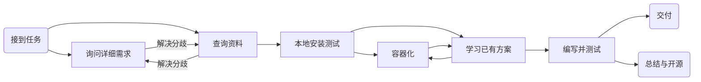
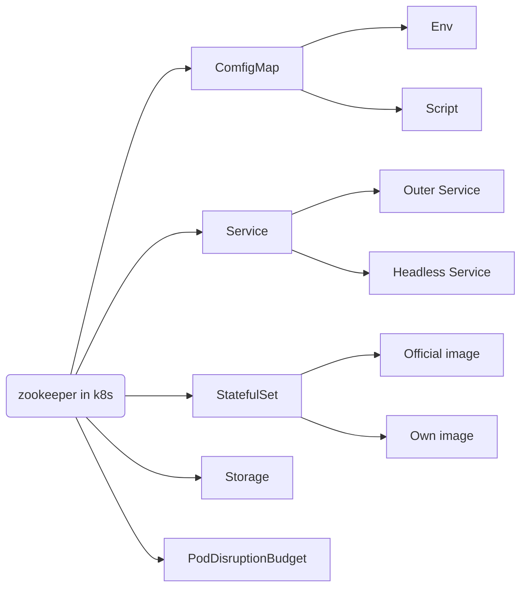

# 11月月度工作汇报

标签（空格分隔）： 工作汇报 总结

---
## 月度工作内容
各位领导各位同事上午好。又到了一月一度的工作汇报，我是云支撑产品研发部的张新杰，我的导师是罗天老师。

本次的月度工作汇报依旧按照以上三个方面进行呈现。

本月的工作相比于前几个月的工作来说，项目的数量上少了很多，这给了我更多的时间去做思考与总结，构建我自己的知识体系。

首先月初的第一周，我帮助丽姐去开了租房用的发票，因为政策变化以及房东的原因，来回奔波花了很多时间。体会到了朝令夕改给办事的人带来的巨大麻烦，所以我们在做设计的时候一定要有规划，项目支持的时候要做好迭代升级，不要突然大改特改。

然后第一周的其他时间，部门内的其他成员也对 admin server 做了一个 code review，提出了很多有用的意见和建议，指导了我跟李桐腱更规范化的开发模式，接受了一个“一切皆代码”的理念。我觉得这就是 devops 中最重要的一个思想。我们也按照指导意见，逐步去完善开发流程，修缮项目。

第2周至第3周两周的时间内，主要负责了李国涛老师的 zookeeper 容器化以及 kubernetes 中部署 zookeeper 的项目支持工作。这是本月的工作重点，算是我第一次独立完成对其他部门的项目支持，详细的过程在后续展开汇报。

本周的主要工作是 admin server 的持续开发，为了提升系统的安全，更新了管理员注册登录界面以及补充了敏感信息的安全加密法则。安全加密的部分我的同事李桐腱已经详细介绍了。

## 项目实现思路

下面详细汇报我对于李国涛老师项目的支持工作的流程。

`接到任务 --> 询问项目详细需求 --> 收集资料 --> 本地安装及测试 --> 查看网上解决方案 -> 学习、理解 --> 编写与测试 --> 交付 --> 总结与开源` 



首先在月初从罗天老师那里接到了李国涛老师的项目支持需求。接到需求后就通过邮件与李国涛老师联系，确定了详细的项目需求，消除了理解上的分歧。之后花了两天时间在网上查看相关的资料，了解 zookeeper 的作用以及使用方法。然后在虚机中搭建了 zookeeper 集群测试其功能完整性，为容器化做好了准备。在做容器化前，先在网上查找了已经有的容器以及在 k8s 中部署的方案，详细学习并理解了各个步骤的功能作用，为项目支持打好技术基础。在自己编写时，参考之前学习的方案，根据实际项目需求做了取舍，完成了服务的编写与测试流程。给国涛老师交付了两套方案以供选择。在交付了之后，我总结了本次的项目支持工作，并将支持的成果发布到了 open.inspur.com 中，以供大家参考和讨论学习。

## 代码讲解

下面是 k8s 服务部署的内容，其实也算是半汇报，半分享我的学习，给部门的其他朋友介绍一下我们部门在做的相关工作。

k8s 的服务可以通过 `kubectl` 命令直接创建，也可以通过 `yaml` 文件统一编写配置。为了让服务可复用，因此选择采用 yaml 文件配置的形式创建。



### Env

通过 k8s 的 `envFrom` 参数可以让容器在创建时动态地从 configMap 中获取环境变量。通过这种灵活的配置，可以让容器的运行随着实际项目的需要做调整而不用重新制作镜像，可以有效提升镜像的通用性，降低系统的耦合度。

```yaml
apiVersion: v1
kind: ConfigMap
metadata:
  name: zk-cm-env
  labels:
    app: zk
data:
  ZK_REPLICAS: "3"                      # zk集群中的节点数\
  ZK_CLIENT_PORT: "2181"                # 修改的话需要把下方容器的暴露端口也改掉
  ZK_SERVER_PORT: "2888"                # 修改的话需要把下方容器的暴露端口也改掉
  ZK_ELECTION_PORT: "3888"              # 修改的话需要把下方容器的暴露端口也改掉
  LOG_LEVEL: "INFO"                     # log4j的日志级别
  ## zk配置，详见http://zookeeper.apache.org/doc/r3.5.6/zookeeperAdmin.html
  ZOO_DATA_DIR: "/data"                 # 存储内存数据库快照的位置
  ZOO_TICK_TIME: "2000"                 # 时间配置中的基本单位（以毫秒为单位）
  ZOO_DATA_LOG_DIR: "/datalog"          # 将事务日志写入dataLogDir
  ZOO_CONF_DIR: "/conf"                 # zk节点的配置的路径
  ··· # 以下省略
```

### Script

ComfigMap 不仅可以作为环境变量添加到容器中，还可以作为文件挂载到容器中。作为文件挂载到容器与直接创建带有该文件的镜像这两种方式在运行时并没有实际上的不同，但是前者相比于后者更好的地方在于，可以使用更公共的镜像去运行，修改起来也更加方便，不用修改一次就创建一次镜像。

```yaml
apiVersion: v1
kind: ConfigMap
metadata:
  name: zk-cm-script
  labels:
    app: zk
data:
  ready: |
    #!/bin/bash
    set -e
    OK=$(echo ruok | nc 127.0.0.1 $1)
    if [[ "$OK" == "imok" ]]; then
        exit 0
    else
        exit 1
    fi
  metrics: |
    #!/bin/sh
    echo mntr | nc localhost $1 >& 1
  start: |
    #!/bin/bash
    set -e
    HOST=`hostname -s`
    DOMAIN=`hostname -d`
  ··· # 以下省略
```

### Service

Service 分为两种，一种是普通的 Service ，用于 Pod 对外提供服务，对于用户来说，可以直接访问 Service 的 IP 就可以直接访问服务，而不用考虑使用哪一个 pod 进行调度，提供服务的 pod 到底在哪个集群节点上。在 Zookeeper 中因为集群要对外提供服务，因此暴露了 2181 端口。

另一种是无头的 Service，用于程序员自己控制集群的负载均衡的策略，或者让应用程序知道属于同组服务的其他实例。在 Zookeeper 中，集群的中的节点需要进行选举和投票，因此需要无头服务来让集群内的节点相互发现、相互访问。

```yaml
apiVersion: v1
kind: Service
metadata:
  name: zk-cluster-service
  labels:
    app: zk
spec:
  ports:
  - port: 2181
    name: client
  selector:
    app: zk
---
apiVersion: v1
kind: Service
metadata:
  name: zk-headless-service
  labels:
    app: zk
spec:
  ports:
  - port: 2888
    name: server
  - port: 3888
    name: leader-election
  clusterIP: None
  selector:
    app: zk
```

### StatefulSet

在 Kubernetes 系统中，Pod 的管理对象 RC、Deployment、DaemonSet 和 Job 都面向无状态的服务。但现实中有很多服务是有状态的，特别是一些复杂的中间件集群，例如 MySQL 集群、kafka 集群、ZooKeeper 集群等，这些应用集群有4个共同点

1. 每个几点有固定的身份ID用于相互发现与通信
2. 集群规模较为固定，通常不能随意拓展
3. 每个节点都是有状态的，通常会持久化数据到永久存储中
4. 集群的容灾能力有限，某个节点受损很可能会影响整个集群的功能

```yaml

```


## 总结学习

通过本次项目支持学习到了：
- zookeeper 的安装与使用
  - 学习了 zookeeper 在命名服务、配置管理、集群管理、分布式锁、队列管理等方面的应用，拓展了知识面。
- 复杂 kubernetes 服务的编写、部署以及查错手段
  - 学习了 k8s 中各种配置的参数，如反亲和性、有状态集群、健康和可用性检查等。通过查看服务的运行日志来获取容器的运行状态与运行信息。 
- k8s ComfigMap 的灵活使用
  - k8s 中 configmap 具有很高的灵活性，既可以集中式作为容器中的环境变量配置，也可以作为文件直接挂载到容器中。通过这种挂载，可以极大降低了容器与项目的耦合性，也就是我们不必每一个项目都手动创建一个镜像，而通过环境变量和挂载的脚本改变容器的状态，提升容器的使用。 
- docker容器权限安全概念
  - 容器安全 Docker 默认将会以超级用户 root  的身份运行容器，容器所属的命名空间（namespace）因此映射为 root 所有，这意味着容器有可能获取  Docker 宿主机的超级管理权限。不仅如此，以 root  用户身份运行容器，还扩大了攻击面，如果容器应用中存在安全漏洞，很容易造成权限提升。因此为了尽量降低安全威胁，需要创建专门的用户和用户组，使用 USER  指定用户，确保以最小权限的用户身份运行容器应用。
- 拥抱开源才能拥抱全世界
  - 一个人的能力是有极限的，我在短暂的项目实践中明白一个道理，越是封闭开发，就越会发现有很多自己不懂的，不能够解决的。拥抱开源，站在巨人的肩膀上做开发才是高效可行的道路。


