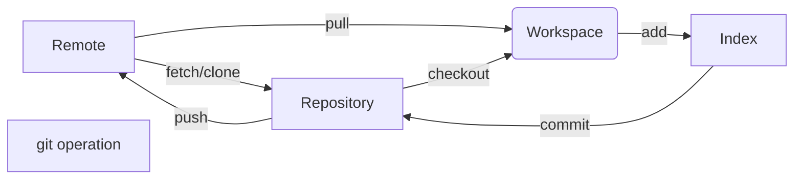

## normal operation
``` bash
git init    # 初始化代码仓库，用于在新文件夹内执行
git remote add <orginName> <http://xxxxxxxx.git>    # 添加源并为该源取名为orginName
git remote rm <orginName>    # 删除某个源
git remote -v    # 查看所有远程仓库
git clone <path>    # 从代码仓库复制一份拷贝到本地，path可以是html/filepath/ftp……
git branch <branchName>    # 创建一个名为branchName的分支
git branch -d [-r] <branchName>    # 删除[远程]分支
git branch -a    # 显示所有分支

git checkout [-b] <branchName>    # (-b表示如果不存在则创建)切换到branchName分支
git checkout -b <localBranch> <origin/originBranch>    # 切换到远程分支

git fetch <远程主机名>    # 这个命令将某个远程主机的更新全部取回本地
git fetch origin <branchName>    # 从远程主机的branchName分支拉取最新内容 
git log -p FETCH_HEAD    # 查看拉下来的分支与当前分支的区别
git merge FETCH_HEAD    # 将拉取下来的最新内容合并到当前所在的分支中
# pull = fetch + merge
git pull <orginName> <originBranch>:<localBranch>    # 将远程分支与本地分支合并

```



## git commit

feat：新功能（feature）
fix：修补bug
docs：文档（documentation）
style： 格式（不影响代码运行的变动）
refactor：重构（即不是新增功能，也不是修改bug的代码变动）
test：增加测试
chore：构建过程或辅助工具的变动