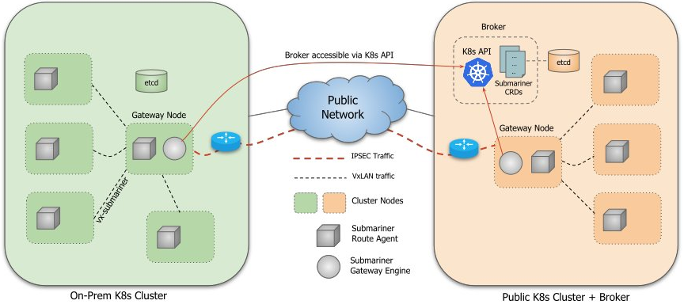
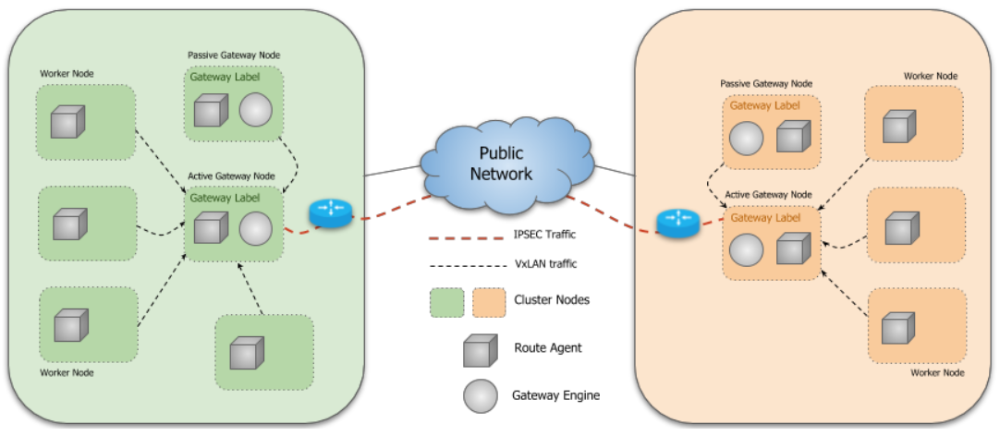
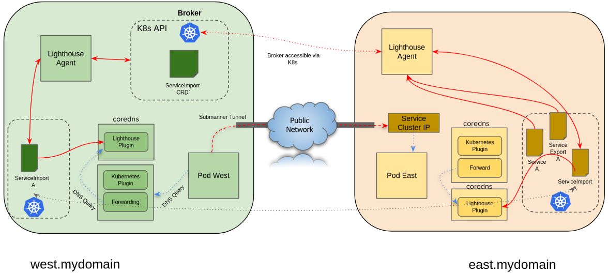
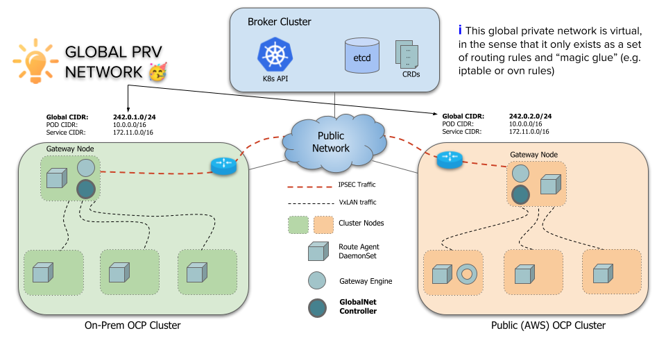
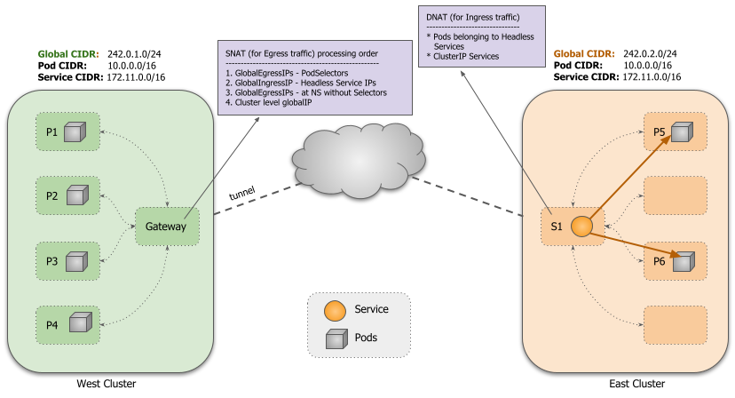

[TOC]

# Submariner Introduction

Submariner由几个主要组件组成，这些组件协同工作，可以跨多个Kubernetes集群安全地连接工作负载。

## 部署需求

Submariner 有一些入门要求：

* 至少两个 Kubernetes 集群，其中一个被指定用作所有连接的集群都可以访问的中央代理；这可以是您连接的集群之一，也可以是专用集群。
* 最老的 [测试 Kubernetes 版本](https://submariner.io/development/building-testing/ci-maintenance/#kubernetes-versions) 是 1.17。已知旧版本不适用于 Submariner。
* 集群之间不重叠的 Pod 和服务 CIDR。这是为了防止路由冲突。对于地址确实重叠的情况， [Globalnet](https://submariner.io/getting-started/architecture/globalnet/) 可以设置。
* 网关节点之间的 IP 可达性。连接两个集群时，网关必须在其公共或私有 IP 地址和封装端口上至少有单向连接。这是在集群之间创建隧道所必需的。默认封装端口为 4500/UDP，用于 [NAT穿越](https://submariner.io/operations/nat-traversal) 使用发现端口 4490/UDP。对于阻止默认端口的企业防火墙后的集群，Submariner 还支持 NAT Traversal (NAT-T)，并可选择设置自定义非标准端口，如 4501/UDP。
* Submariner 使用 UDP 端口 4800 封装从工作节点和主节点到网关节点的 Pod 流量。这是为了保留 Pod 的源 IP 地址所必需的。确保防火墙配置允许集群中所有节点双向使用 4800/UDP。使用 OVN-Kubernetes CNI 时，这不是必需的。
* Submariner 使用 TCP 端口 8080 导出网关节点上的指标。确保防火墙配置允许网关节点上的入口 8080/TCP，以便集群中的其他节点可以访问它。此外，网关节点上的其他工作负载不应监听 TCP 端口 8080。
* 所有已连接集群上的工作程序节点 IP 必须在 Pod/Service CIDR 范围之外。

Submariner 设计为与云提供商无关，应该在任何标准 Kubernetes 集群中运行。Submariner 已使用以下网络 (CNI) 插件进行了测试：

<ul>
  <li><a style="text-decoration: none; " href="https://github.com/openshift/sdn" class="external-link"
      rel="nofollow">OpenShift-SDN</a></li>
  <li><a class="external-link" href="https://github.com/weaveworks/weave" style="text-decoration: none; "
      rel="nofollow">Weave</a></li>
  <li><a class="external-link" href="https://github.com/coreos/flannel" style="text-decoration: none; "
      rel="nofollow">Flannel</a></li>
  <li><a href="https://docs.projectcalico.org/getting-started/kubernetes/flannel/flannel" class="external-link"
      style="text-decoration: none; " rel="nofollow">Canal</a></li>
  <li><a href="https://www.projectcalico.org/" style="text-decoration: none; " class="external-link"
      rel="nofollow">Calico</a>&nbsp; (see the&nbsp; <a style="text-decoration: none; "
      href="https://submariner.io/operations/deployment/calico/" class="external-link" rel="nofollow">Calico-specific
      deployment instructions</a>)</li>
  <li><a style="text-decoration: none; " href="https://github.com/ovn-org/ovn-kubernetes" class="external-link"
      rel="nofollow">OVN</a></li>
</ul>

## 组件

Submariner 以安全和高性能的方式连接多个 Kubernetes 集群。Submariner 将连接的集群之间的网络扁平化，并实现 Pod 和服务之间的 IP 可达性。Submariner 还通过 Lighthouse
  提供服务发现功能。服务发现模型是使用提出的&nbsp;<a style="text-decoration: none;" class="highlight"
    href="https://github.com/kubernetes/enhancements/tree/master/keps/sig-multicluster/1645-multi-cluster-services-api">Kubernetes
    多集群服务</a>.

Submariner 由几个主要组件组成，它们协同工作以安全地连接多个 Kubernetes 集群（包括本地和公共云）上的工作负载：

<ul>
  <li><a class="highlight" style="text-decoration: none;text-align: left;"
      href="https://submariner.io/getting-started/architecture/gateway-engine/">Gateway Engine</a>：管理到其他集群的安全隧道。</li>
  <li><a style="text-decoration: none;text-align: left;"
      href="https://submariner.io/getting-started/architecture/route-agent/" class="highlight">Route
      Agent</a>：将跨集群流量从节点路由到活动网关引擎。</li>
  <li><a class="highlight" style="text-decoration: none;"
      href="https://submariner.io/getting-started/architecture/broker/">Broker</a>：促进网关引擎之间的元数据交换，使它们能够相互发现。</li>
  <li><a class="highlight" style="text-decoration: none;text-align: left;"
      href="https://submariner.io/getting-started/architecture/service-discovery/">Service Discovery</a>：提供跨集群服务的 DNS
    发现。</li>
</ul>

Submariner 具有提供附加功能的可选组件：

<ul>
  <li><a class="highlight" style="text-decoration: none;text-align: left;"
      href="https://submariner.io/getting-started/architecture/globalnet/">Globalnet Controller</a>：处理具有重叠 CIDR 的集群的互连。
  </li>
</ul>

下图说明了 Submariner 的基本架构：

### Broker

Submariner 使用集中式的 Broker 组件来促成部署在多集群中的 Gateway Engine 之间的元数据信息交换。Brocker 使用一组
            CRD 来实现数据交换：Endpoint 和 Cluster。 Endpoint CRD 包含有关集群中活动的Gateway Engine的信息，例如用于集群见相互连接的 IP。 Cluster CRD
            包含有关原始集群的静态信息，例如其 Service 和 Pod CIDR。

Broker是一个单实例组件，需要部署在一个所有成员集群都可访问的集群上，可以作为成员集群，也可以部署在独立集群上。但所有成员集群的 Gateway
            Engine 都会使用安全连接到 Broker 所在的 k8s apiserver

Broker 集群的可用性不会影响成员集群上 dataplane 的操作，即当 Broker 不可用时，dataplane
            将继续使用最后一个已知信息路由流量。但是，在此期间，控制平面组件将无法向其他集群发布新信息或更新信息，也无法从其他集群了解新信息或更新信息。当与 Broker 重新建立连接时，每个组件将自动与 Broker
            重新同步其本地信息，并在必要时更新数据平面。

### Gateway Engine

Gateway Engine 组件部署在每个成员集群中，负责建立到其他集群的安全隧道。

Gateway Engine 用于维护隧道的网络组件是可插拔的，可以使用以下实现：

<ul>
  <li>使用&nbsp;<a style="text-decoration: none;text-align: left;"
      href="https://libreswan.org/" class="highlight">Libreswan</a>&nbsp;实现&nbsp;IPsec （这是当前的默认设置）</li>
  <li><a class="highlight" href="https://www.wireguard.com/"
      style="text-decoration: none;text-align: left;">WireGuard</a>&nbsp;的实现（通过&nbsp;<a style="text-decoration: none;"
      href="https://github.com/WireGuard/wgctrl-go" class="highlight">wgctrl</a>&nbsp;工具包）（WireGuard
    需要在网关节点上安装，见&nbsp;<a href="https://www.wireguard.com/install/" style="text-decoration: none;"
      class="highlight">WireGuard 安装说明</a>）。</li>
  <li>使用 VXLAN 实现一个未加密的隧道。（VXLAN 连接在设计上未加密。这对于所有参与的集群都在本地运行、底层网络间结构受到控制并且在许多情况下已经通过其他方式加密的环境通常很有用。）</li>
</ul>

Gateway Engine 的实例在集群中特定指定的节点上运行，其中可能有多个节点用于容错。Submariner 支持 Gateway Engine
            组件的主动/被动高可用性，这意味着集群中一次只有一个活动 Gateway Engine
            实例。他们执行领导者选举过程以确定活动实例，其他人在待机模式下等待准备好在活动实例失败时接管。

活动的 Gateway Engine 与中央 Broker 通信，以将其 Endpoint 和 Cluster 资源通告给连接到 Broker
            的其他集群，同时确保它持有的 Endpoint <code>是</code>其集群的唯一。在成员集群中运行的&nbsp;<a style="text-decoration: none;"
              class="highlight" href="https://submariner.io/getting-started/architecture/route-agent/">Route
              Agent</a>&nbsp;Pod 了解本地 Endpoint 并设置必要的基础架构以将跨集群流量从所有 k8s node 路由到活动的 Gateway Engine 节点。活动的&nbsp;Gateway
            Engine 还在 Broker 上建立监听以了解其他集群通告的活动&nbsp;Endpoint 和 Cluster 资源。一旦两个集群知道彼此的 Endpoint
            ，它们就可以建立一个安全的隧道，通过该隧道可以路由流量。

 Gateway Engine 会持续监控连接集群的运行状况。它定期 ping 每个集群并收集统计数据，包括基础的连通性、往返时间 (RTT)
            和平均延迟。此信息在 Gateway 资源中更新。每当 Gateway Engine 检测到对特定集群的 ping
            失败时，它的连接状态都会被标记为错误状态。服务发现使用此信息来避免服务发现期间不健康的集群。该功能是可选的。

### Service Discovery

Lighthouse 项目为由 Submariner 连接的在多集群环境提供 DNS 发现。 Lighthouse 实现了 Kubernetes 多集群服务
            API (<a style="text-decoration: none;" href="https://github.com/kubernetes-sigs/mcs-api"
              class="highlight">Multi-Cluster Service APIs</a>)。架构如下：

工作流程如下：

<ol>
  <li>服务导出与服务导入<ul>
      <li>Lighthouse Agent 运行在每个成员集群中，并连接到 Broker 所在的 Kubernetes API server。</li>
      <li>对于本地集群中已创建 ServiceExport 的每个 Service，Lighthouse Agent 都会创建相应的 ServiceImport 资源并将其导出到 Broker 以供其他集群使用。</li>
      <li>对于每一个导出到 Broker 中的 ServiceImport 资源，Lighthouse Agent 会在本地集群中创建它的副本。</li>
    </ul>
  </li>
  <li>Lighthouse DNS发现<ul>
      <li>Pod 尝试使用域名解析服务名称 clusterset.local。（clusterset.local的域由coredns外部的Lighthouse DNS Server所拥有，Lighthouse DNS 服务器支持使用 A 记录和 SRV 记录的查询。）</li>
      <li>CoreDNS 将请求转发到 Lighthouse DNS 服务器。</li>
      <li>Lighthouse DNS 服务器将使用其 ServiceImport 缓存来尝试解析请求。</li>
      <li>如果记录存在，则返回，否则返回 NXDomain 错误。</li>
      <li>当单个服务部署到多个集群时，Lighthouse DNS 服务器会优先选择本地集群，然后以循环方式将流量路由到其他远程集群。</li>
    </ul>
  </li>
</ol>

### Route Agent

Route
          Agent 在成员集群的每个节点上运行，它负责在已有的 Kubernetes CNI 插件之上设置必要的主机网络配置。

kube-proxy iptables 模式：

对于在 iptables 模式下使用 kube-proxy 的 CNI 插件，Route Agent 负责设置 VXLAN 隧道并将跨集群流量从节点路由到集群的运行中的&nbsp;Gateway
          Engine，Gateway Engine
        随后将流量发送到目标集群。

当与运行中的
          Gateway Engine 在同一节点上运行时，Route Agent 会创建一个 VXLAN VTEP 接口，通过与运行中的 Gateway
          Engine 节点的 VTEP 建立 VXLAN 隧道，在本地集群中的其他工作节点上运行的 Route Agent
  实例连接到该接口。VXLAN隧道的MTU是根据主机默认接口的MTU减去VXLAN开销来配置的。

Route Agent
      使用由其他集群同步来的 Endpoint CRD 来配置路由并编写必要的 iptables 规则以实现完整的跨集群连接。

当运行中的
          Gateway Engine 发生故障并且新的 Gateway Engine
        接管时，Route
        Agent 将自动更新每个节点上的路由表以指向新运行中的&nbsp;Gateway
          Engine&nbsp;节点。

### Globalnet Controller

如前所述，使用Submariner要求集群的CIDR各不相同，但实际上很多集群在部署时往往使用默认的CIDR；另一方面，更改已部署好的集群的CIDR是一个非常具有破坏性的过程，需要重启整个集群。基于这个原因，Submariner
          设计了Globalnet组件。

Globalnet是一个虚拟网络组件，每个集群会从该虚拟全局专用网中自动获得或者手动指定一个子网，作为多集群中的全局
          CIDR。

<ul>
  <li>集群范围内使用的IP: 每个集群上配置了若干个在全局CIDR范围内的全局出口IP（默认为8个, 由&nbsp;ClusterGlobalEgressIP&nbsp;资源进行配置），用于跨集群通信。运行在集群网络内的应用也通过这些IP访问远程集群。
  </li>
  <li>局部范围内使用的IP: 可以为某个Namespace单独配置全局IP（由 GlobalEgressIP 资源配置），IP也是在全局 CIDR 范围内的，优先级上高于ClusterGlobalEgressIP;
            除了namespace外，还可以进一步为某些指定的Pod（通过labelSelector）配置全局IP，优先级最高。</li>
</ul>

所有导出的ClusterIP类型的服务会自动从全局CIDR中分配一个IP作为访问入口。

对于无头服务，每个Pod都会分配一个用于流量出入的全局IP。但如果该Pod配置了&nbsp;GlobalEgressIP，该全局IP将仅作为流量出口。

路由和
          iptable 规则会配置为使用相应的全局 IP 进行出入。所有地址转换都发生在集群的活动的&nbsp;Gateway Engine
            所在的节点上。

与Lighthouse组合实现Pod跨集群服务发现：Lighthouse 控制器在为 ClusterIP 类型的服务创建 ServiceImport 时使用服务的全局 IP。对于无头服务，在创建要分发到其他集群的
  EndpointSlice 资源时使用 pod 的全局 IP。然后，Lighthouse 插件在回复 DNS 查询时使用全局 IP 回复，从而实现跨集群服务发现。

Globalnet由两个子组件共同完成：

<ul>
  <li>
    
IP Address Manager (IPAM)

    <ul>
      <li>根据集群上配置的 GlobalCIDR 创建 IP 地址池。</li>
      <li>从全局IP池中为所有入口和出口分配 IP，并在不需要时释放它们。</li>
    </ul>
  </li>
  <li>Globalnet<ul>
      <li>为 Globalnet 规则创建初始 iptables 链。</li>
      <li>对于每个 GlobalEgressIP，创建相应的 SNAT 规则，以将所有匹配 pod 的源 IP 转换为分配给 GlobalEgressIP 对象的相应全局 IP。</li>
      <li>对于每个导出的服务，创建一个入口规则，将所有发往服务全局 IP 的流量引导到服务的 kube-proxy iptables 链，进而将流量引导到服务的后端 pod。</li>
      <li>在删除 Pod、Service 或 ServiceExport 时从网关节点清除规则。</li>
    </ul>
  </li>
</ul>

Globalnet 目前依赖于 kube-proxy，因此仅适用于使用 kube-proxy 的部署。

先决条件：

<ol>
  <li>关闭准入控制器 <a
      href="https://kubernetes.io/zh-cn/docs/reference/access-authn-authz/admission-controllers/#denyserviceexternalips">DenyServiceExternalIPs</a>
  </li>
  <li>限制带有externalIPs的Service:<ul>
      <li>OpenShift: 不需要额外配置</li>
      <li>其他Kubernetes发行版: 启用 externalip-webhook，同时指定 allowed-external-ip-cidrs
          需要包括分配给集群的 GlobalCIDR ，配置 allowed-usernames 以包括
          system:serviceaccount:submariner-operator:submariner-globalnet</li>
    </ul>
  </li>
</ol>