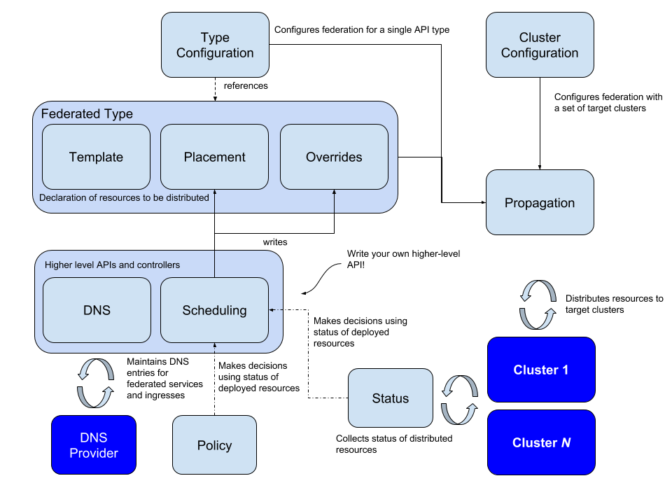

# Kubefed 技术调研

> ref:
> https://github.com/kubernetes-sigs/kubefed
> https://cloud.tencent.com/developer/article/1804669
> https://blog.csdn.net/zpf17671624050/article/details/108159647

## 架构和总体实现机制



Kubefed 使用 kubernetes 上广泛使用的 `CRD` + `controller` 模式来管理多集群，因此能和普通的 k8s 兼容，无需做额外的改造，目前项目尚处于 Alpha 版。

Kubefed 配置两种资源信息：

* **Cluster configuration** 声明 KubeFed 应该针对哪些集群，访问这些集群所需的信息、凭证等
* **Type configuration** 声明 KubeFed 应该处理哪些 API 类型，通过 CRD 拓展的方式，关联到 K8s 中的资源

**Propagation** 是指将资源分配到联合集群的机制

**Type configuration** 具有三种基本概念：

* **Template** kubefed 所关联的资源的实际定义。例如一个 FederatedDeployment 的 Template 就包含了 Deployment 的 spec 的所有信息
* **Placement** 指出了该资源将会部署到哪些集群，目前支持 `指定集群名` 和 `集群选择器` 两种方式
* **Overrides** 针对不同的集群，通过 Patch 的形式，增加 / 删除 / 修改 template 中的字段

**scheduling** 定义了应用在集群之间的分布状态。目前支持 ReplicaSet 和 Deployment 的跨集群调度策略

**status** 收集资源在各个集群中的状态

## 安装与部署

参见 [installation](Test-Kubefed-with-Kind.md#installation)

## 应用跨集群基本能力验证

参见 [testing](Test-Kubefed-with-Kind.md#testing)

## 网络的配置要求

要求 Host 集群的 control plane 能够访问所有的集群的 APIServer

## 存储的配置要求

无额外的存储需求，主要依赖于 HOST 集群的 ETCD 来存储资源

## 多集群管理方式

支持添加删除集群，HOST 集群通过 kubeconfig 文件访问其他集群的 APIServer 来管理多集群

## 应用跨集群管理

支持手动配置跨集群应用和自动配置跨集群应用。

手动配置指在创建 Federated 资源时，在 Placement 字段中通过指定集群名称或者指定集群选择器来手动设置跨集群应用。

自动配置指通过 ReplicaSchedulingPreference 绑定 Deployment/ReplicaSet 资源，同过配置应用的总数量以及不同集群的权重对于应用的权重、最小部署量、最大部署量，自动配置集群上应用的数量。通过自动配置的集群，当集群无法连接时，controller会负责计算可用副本是否满足数量要求，从而补充应用副本数。

目前的应用管理支持的能力比较初级，无法根据集群负载来动态调度，也不支持弹性配置。

另外，在集群挂了重启之后，不保证应用会重新调度到该集群上。如下:

```BASH
# cluster3 断开一段时间后重新连接
# ReplicaSchedulingPreference 配置为：
#   totalReplicas: 6
#   clusters:
#     c1:
#       minReplicas: 2
#       maxReplicas: 3
#       weight: 1
#     c2:
#       minReplicas: 2
#       maxReplicas: 5
#       weight: 2
#     c3:
#       weight: 1

# cluster3 上不会调度应用
$ kubectl get deploy -n fed-test -owide --context cluster3
NAME         READY   UP-TO-DATE   AVAILABLE   AGE     CONTAINERS   IMAGES         SELECTOR
fed-deploy   0/0     0            0           7m38s   nginx        nginx:alpine   app=nginx

$ kubectl get deploy -n fed-test -owide --context cluster2
NAME         READY   UP-TO-DATE   AVAILABLE   AGE   CONTAINERS   IMAGES         SELECTOR
fed-deploy   3/3     3            3           2d    nginx        nginx:alpine   app=nginx

$ kubectl get deploy -n fed-test -owide --context cluster1
NAME         READY   UP-TO-DATE   AVAILABLE   AGE   CONTAINERS   IMAGES         SELECTOR
fed-deploy   3/3     3            3           2d    nginx        nginx:alpine   app=nginx
```

## 开源社区状态

Github: 
* star: `1.7k`
* fork: `413`
* issue: `19 open` `491 closed`
* pull request: `8 open` `919 closed`

目前项目仍然处于 `alpha` 状态, 版本还在迭代中, 迭代速度较慢

* v0.8.1 20210629
* v0.8.0 20210622
* v0.7.0 20210326
* v0.6.1 20210126
* v0.6.0 20201218
* v0.5.1 20201113
* v0.5.0 20201027
* v0.4.1 20201005
* v0.4.0 20200818
* v0.3.1 20200722

## 云厂商产品化状态

* KubeSphere 集成了 Kubefed 的功能
* Aliyun 支持创建 kuibefed 集群联邦
* OpenShift 支持 Kubefed
* huawei 基于 Federation V1 和 V2(Kubefed) 开发了新的 Karmada 项目, 用于华为 MCP 项目

## Roadmap

目前并无明确的 Roadmap, 目前社区在做的一些方向是:

* 切割当前的项目为两个子项目, 一个是核心能力, 一个是调度
* 支持控制平面支持拉取模式
* 清除一些实验性功能以保证代码清洁和简化维护

## 可扩展性

由于其主体是基于 kubernetes 的 CRD 来实现功能的, 因此可拓展性较好.

## 便捷性

使用上将无法维持原本熟悉的资源, 而需要使用封装好的新的联邦资源, 需要额外适应. 另一方面, 联邦资源状态无法像原生资源一样直观/齐全, 还是得在对应的集群上查看具体状态.

## 局限性

* 需要一个 Host 集群, 并且该集群应当能够访问其他的所有集群
* 联邦资源的管理比较初步
* 资源管理不够直观
* 需要一个 Host 集群, 可能有单点问题

## 其它

跨集群服务网络和服务发现的能力, 需要引入 `Istio`  `Ingress` 等网络插件来实现. 在之前的版本中 Kubefed 支持 DNS 的相关配置, 当前版本中似乎删除了这个特性, 本人没有找到相关的文档. 但 istio 本身支持多种跨集群方案可供选择.

## 后话

不清楚是由于项目的未来发展方向模糊还是因为实际应用中的不足之处, 开发它的厂商之一, 华为选择基于联邦另外创建了新的 Karmada 项目. 就本人浅尝则止的使用体验来说, 这个联邦的方案已经初步实现了跨集群的管理, 但是可能未来还有很长的路要走.
