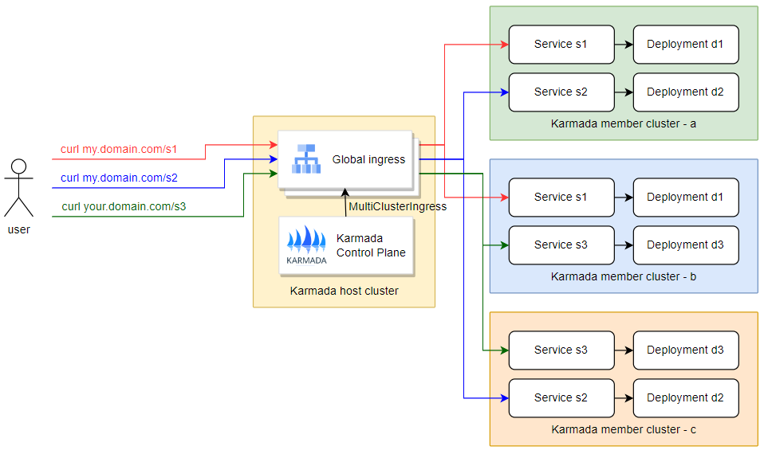
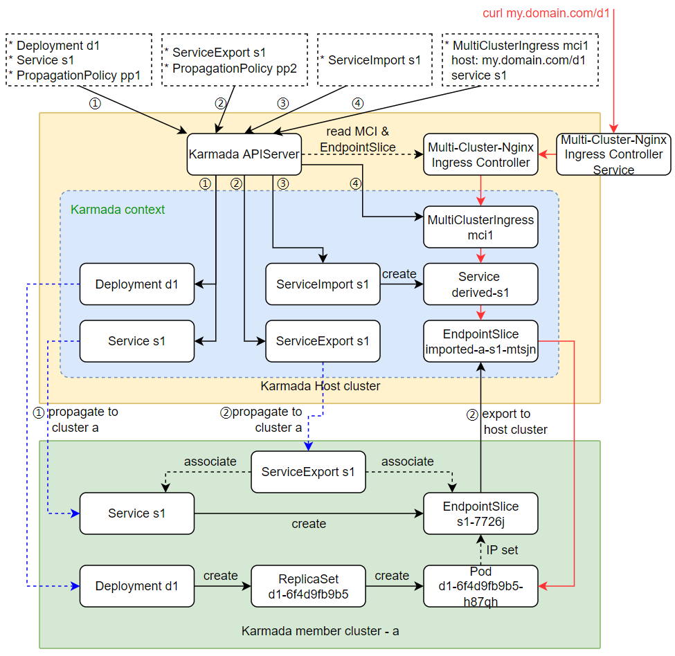

[TOC]

# Karmada中的MCI(Multi-cluster Ingress)

## 使用场景

用户在使用多集群时，需要将不同的服务部署到不同的集群中，例如：服务s1专门用于web服务，提供界面供用户使用；服务s2专门用于后台管理，为管理员服务；服务s3为另一个产品的业务服务。

通过多集群ingress可以实现用户无感地使用同一个url访问到这些跨集群的服务，就算某个集群服务离线了或者宕机了，ingress的访问将自动切换到另一个可用的服务，从而不会影响业务的正常使用。



## 依赖

* Karmada版本 v1.1.0 及以上
* 控制集群与纳管集群需要处于不同的 CIDR (可以使用submariner解决 CIDR 问题)
* 控制集群与纳管集群之间网络联通（只支持push模式）

## 部署流程

1. 配置 ClusterPropagationPolicy ，在需要跨集群访问的集群中部署 ServiceImport 和 ServiceExport CRD （注：只需要部署 CRD，不需要部署 MCS controller，因为 Karmada 内部实现了一套机制）

```yaml
# propagate ServiceExport CRD
apiVersion: policy.karmada.io/v1alpha1
kind: ClusterPropagationPolicy
metadata:
  name: serviceexport-policy
spec:
  resourceSelectors:
    - apiVersion: apiextensions.k8s.io/v1
      kind: CustomResourceDefinition
      name: serviceexports.multicluster.x-k8s.io
  placement:
    clusterAffinity:
      clusterNames:
        - member1
        - member2
---       
# propagate ServiceImport CRD
apiVersion: policy.karmada.io/v1alpha1
kind: ClusterPropagationPolicy
metadata:
  name: serviceimport-policy
spec:
  resourceSelectors:
    - apiVersion: apiextensions.k8s.io/v1
      kind: CustomResourceDefinition
      name: serviceimports.multicluster.x-k8s.io
  placement:
    clusterAffinity:
      clusterNames:
        - member1
        - member2
```

2. 在控制集群中部署 multi-cluster-ingress-nginx (需要在底层的 k8s 中部署，而不是在 karmada 的 apiserver 中)，具体部署流程可以参考以下：
  * https://github.com/karmada-io/karmada/blob/master/docs/multi-cluster-ingress.md#step-1-deploy-ingress-nginx-on-the-host-cluster
  * https://github.com/karmada-io/karmada/pull/1925/files?short_path=94adaff#diff-94adaffaaff24c50c94cfad71dda074ffeb3a003e7e2dd508b68d192bc66d029

3. 部署应用并测试

```yaml
apiVersion: apps/v1
kind: Deployment
metadata:
  name: web
  namespace: jack
spec:
  replicas: 1
  selector:
    matchLabels:
      app: web
  template:
    metadata:
      labels:
        app: web
    spec:
      containers:
      - name: hello-app
        image: luomonkeyking/hello-app:1.0
        ports:
        - containerPort: 8080
          protocol: TCP
---     
apiVersion: v1
kind: Service
metadata:
  name: web
  namespace: jack
spec:
  ports:
  - port: 81
    targetPort: 8080
  selector:
    app: web
---
apiVersion: policy.karmada.io/v1alpha1
kind: PropagationPolicy
metadata:
  name: mcs-workload
  namespace: jack
spec:
  resourceSelectors:
    - apiVersion: apps/v1
      kind: Deployment
      name: web
    - apiVersion: v1
      kind: Service
      name: web
  placement:
    clusterAffinity:
      clusterNames:
        - member1
---
apiVersion: multicluster.x-k8s.io/v1alpha1
kind: ServiceExport
metadata:
  name: web
  namespace: jack
---
apiVersion: policy.karmada.io/v1alpha1
kind: PropagationPolicy
metadata:
  name: web-export-policy
  namespace: jack
spec:
  resourceSelectors:
    - apiVersion: multicluster.x-k8s.io/v1alpha1
      kind: ServiceExport
      name: web
  placement:
    clusterAffinity:
      clusterNames:
        - member1
---
apiVersion: multicluster.x-k8s.io/v1alpha1
kind: ServiceImport
metadata:
  name: web
  namespace: jack
spec:
  type: ClusterSetIP
  ports:
  - port: 81
    protocol: TCP
---
apiVersion: networking.karmada.io/v1alpha1
kind: MultiClusterIngress
metadata:
  name: demo-localhost
  namespace: jack
spec:
  ingressClassName: nginx
  rules:
  - host: demo.localdev.jack
    http:
      paths:
      - backend:
          service:
            name: web
            port:
              number: 81
        path: /jack
        pathType: Prefix
```

4. 测试结果

```BASH
# "172.18.0.5" 为控制集群的 master IP
# "31590" 为 NodePort 形式部署的 MultiClusterIngress 控制器的 Service 端口号
# "demo.localdev.jack" 和 "/jack" 为上述 MultiClusterIngress 配置的路由
$ curl 172.18.0.5:31590/jack -H 'Host: demo.localdev.jack'
Hello, world!
Version: 1.0.0
Hostname: web-6f4d9fb9b5-cbgxq
```

## 原理

Karmada内置了ServiceExportController 以及 ServiceImportController，不仅实现了 MCS controller 的功能，也补充了 export 的能力。具体原理如下所示。



1. 部署Deployment以及对应的Service，将其发布到联邦集群中
2. 创建Service同名同namespace的ServiceExport，将其发布到前面部署的联邦集群中。Karmada的控制器会依据PropagationPolicy读取该ServiceExport相关联的EndpointSlice，并将其导入到Karmada的context中
3. 创建Service同名同namespace的ServiceImport，可以发布到联邦集群，也可以不发布（发布了的话可以在被引入的集群中访问到，不发布就相当于只在Karmada中导入该Service）。Karmada控制器会读取该ServiceImport，依据名称创建出一个派生服务derived-s1
4. 创建MultiClusterIngress 对象（实际上是官方Ingress对象改名）。Multi-Cluster-Nginx Ingress Controller会读取该MCI对象，依据其声明的Service名称，查询其关联的派生服务，获取派生服务的EndpointSlice端点列表，写入Nginx配置。
5. 使用MultiClusterIngress 声明的域名和路由访问Multi-Cluster-Nginx Ingress Controller的服务，就会路由到联邦集群的服务中。
