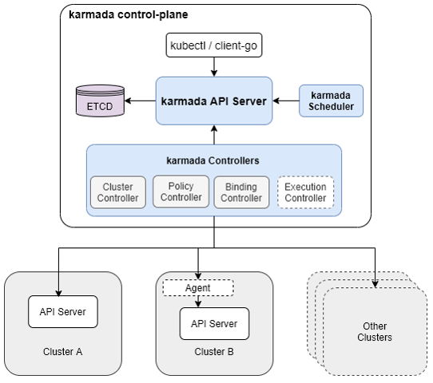

# Karmada summary

> ref:
> - https://github.com/karmada-io/karmada
> - https://mp.weixin.qq.com/s/xPQbFSPgXtlhVNAL0-wfDg
> - https://zhuanlan.zhihu.com/p/379449374

## 简介

Karmada (Kubernetes Armada) 是一个 Kubernetes 管理系统，使您能够跨多个 Kubernetes 集群和云运行您的云原生应用程序，而无需更改您的应用程序。通过使用 Kubernetes 原生 API 并提供高级调度功能，Karmada 实现了真正开放的多云 Kubernetes。

Karmada 旨在为多云和混合云场景提供开箱即用的自动化多集群应用管理，其关键特性包含集中式多云管理、高可用性、故障恢复和流量调度等。

## 能力

Karmada重点关心的能力：

- 兼容k8s原生API
- 支持多网络模式

Karmada能力全景图（下图灰色部分）

## 架构

Karmada控制面为一个独立集群，目前是专用于跨集群能力管理，应用不允许运行在控制面（未来版本可能会开放一些插件应用运行权限）。

- APIServer处理K8s原生API以及Karmada资源
- ETCD存储资源对象
- Controller管理资源对象
  * Cluster controller管理集群生命周期
  * Policy controller管理资源跨集群传播规则，负责创建ResourceBinding
  * Binding controller管理ResourceBinding资源，绑定资源和集群相关的work对象
  * Execution controller管理Work对象，负责将work分配给集群
- Scheduler管理资源的调度策略

## 工作流程

1. 部署K8s原生资源
2. 依据Propagation Policy生成ResourceBinding资源
  a. 支持1对多资源自动映射
3. 按照Override Policy修改不同集群上的模板资源
  a. 支持修改镜像仓库
  b. 支持修改模板字段
4. 绑定到work资源中，下发到集群

## 安装需求

- 集群需求
  * 需要一个独立集群作为控制面，控制面无法部署应用
- 存储需求
  * 控制面使用ETCD作为存储
- 网络需求
  * 支持push和pull模式，无需求

## 安装与部署

参见[Test-Karmada-with-Kind](Test-Karmada-with-Kind.md)

## 应用跨集群基本能力验证

参见[Test-Karmada-with-Kind](Test-Karmada-with-Kind.md)

## 跨集群服务能力

官方目前暂未实现跨集群服务能力，预计在后续版本中会提供相关的支持。

预计的方案应该是基于Istio实现。

## 历史及开源社区状态

Karmada是于2020年基于 Kubernetes Federation v1 和 v2 开发的跨集群服务，于 2021年4月正式开源

截至2021年7月20日 Github 上收获

- Star：1.3k
- Fork：183
- Issue：46 Open，88 Closed
- Pull request：14 Open，391 Closed

版本历史：

| release | date     |
| ------- | -------- |
| V0.7.0  | 20210712 |
| V0.6.0  | 20210529 |
| V0.5.0  | 20210420 |
| V0.4.0  | 20210313 |
| V0.3.0  | 20210208 |
| V0.2.0  | 20210107 |
| V0.1.0  | 20201204 |

基本上一个月左右发布一个小版本，较为活跃。

## Roadmap及产品化

联合发起单位：Huawei，ICBC，浦发银行，小红书，VIPkid，中国一汽等8家国内厂商

## 总结

- 基于开源项目二次开发，吸取了一些经验，架构上更为先进，功能更多
- 目前发展速度较快，社区活跃度尚可
- 国人开发，交流反馈较为方便（不用跨时区，可利用国内的交流工具）
