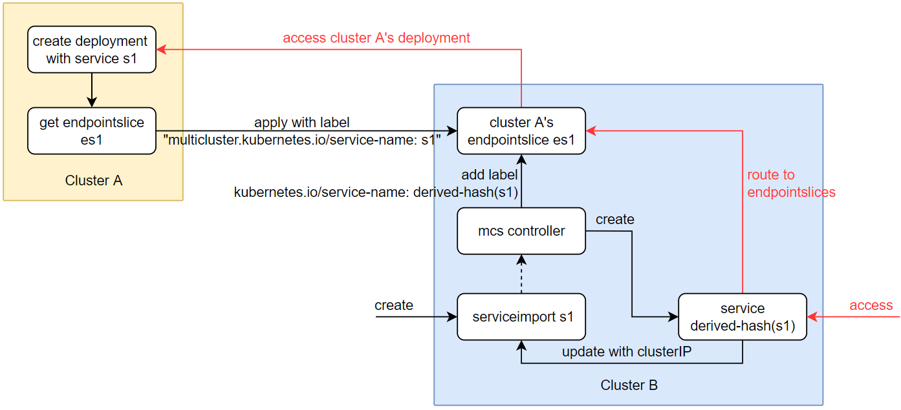

[TOC]

# multi cluster service demo

ref:
* https://github.com/kubernetes/enhancements/tree/master/keps/sig-multicluster/1645-multi-cluster-services-api

## User Stories

1. 不同的服务分别部署到不同的集群
    有 2 个集群，每个集群运行由不同团队管理的不同服务，其中一个团队的服务依赖于另一个团队的服务。想确保一个团队的服务可以发现另一个团队的服务（通过 DNS 解析到 VIP），无论他们所在的集群如何。此外，想确保是否迁移了依赖服务到另一个集群，被依赖者不受影响。

2. 单个服务部署到多个集群
    已将某服务部署到多个集群以实现高可用冗余或扩展，如镜像服务。现在想将拓扑感知服务端点（本地、区域、全局）传播到所有集群，以便集群中的其他服务可以根据可用性和位置按优先级顺序访问该服务的实例。对我的高可用服务的请求应该在我的服务实例之间无缝转换（在 SLO(service-level objectives)内丢弃请求），以防在调用者没有采取行动或影响调用者的情况下发生故障或删除。路由到我的复制服务应该针对成本指标进行优化（例如，优先考虑区域、区域的本地流量）。

**使用场景：** 由于业务拓展，原本部署在同一个region中的服务无法满足需求，因此需要将其拓展。

1. （无感访问）为了保障重要数据的私密性以及对外服务的可用性，将敏感数据库服务都部署到了公司私有的集群A中，而常用的Web服务以及开放API服务全部部署到距离用户较近的Region的集群B、C、D中。此时集群B\C\D希望可以无感地访问到集群A中的私有服务；同时，如果集群A中的数据库服务发生了动态拓展或者切换部署集群，也希望B\C\D集群不进行连接配置更改就能正常访问
2. （跨集群多副本高可用）B、C、D集群的Web服务以及开放API服务为跨集群高可用的多副本服务。在服务运行过程中可能因为服务访问量的差异性而需要扩容或者缩容某些region下的服务，此时希望在动态扩缩容的过程中，用户能无感知地进行服务访问；另一方面，当某些集群由于发生故障而宕机时，该region下的用户访问这些服务时，希望用户的请求能够被正确地自动地切换到其他可用集群上

## Design Details

引入新的 CRD 来指定哪些service被导出为多集群service，哪些集群将要导入这些多集群的service

* ServiceImport (mcs 已实现)
   - 用处: 用户手动将集群外部服务导入到本集群中
   - 基本原理: 利用无选择器（selector）service 的特性，可以人为将一些指定的 endpoint IP 地址绑定到该 service
   - 选择 endpointslice (Kubernetes v1.21 [stable]) 的原因: endpoint 有性能限制，不能接受太多IP，而 endpointslice 支持更多的 IP（默认为100个，可以使用 kube-controller-manager 的 --max-endpoints-per-slice 标志设置此值，最大值为 1000）
* ServiceExport (mcs 未实现)
   - 用处: 在多集群范围内，声明当前集群内的同命名空间同名的 service 将要被导出到多集群中，即：控制器会自动在多集群中创建针对该 service 的 ServiceImport；若删除 ServiceExport，则自动解除多集群中的 ServiceImport

## prepare in new centos7.8-minimal

```BASH
mkdir /etc/yum.repos.d/bak
mv /etc/yum.repos.d/*.* /etc/yum.repos.d/bak
curl -o /etc/yum.repos.d/CentOS-Base.repo http://mirrors.aliyun.com/repo/Centos-7.repo
yum makecache fast
yum install bash-completion net-tools -y

curl -sSL https://get.docker.com | sh
systemctl enable docker && systemctl restart docker
docker version

tar -C /usr/local -xzf go1.17.linux-amd64.tar.gz

echo "export GOPATH=/root/go
export PATH=$PATH:/usr/local/bin:/usr/local/go/bin:$GOPATH/bin" >> /etc/profile
source /etc/profile
go version
go env -w GOPROXY=https://goproxy.cn,direct

go install sigs.k8s.io/kind@v0.14.0
kind version

yum install git -y
git version

cat <<EOF > /etc/yum.repos.d/kubernetes.repo
[kubernetes]
name=Kubernetes
baseurl=https://mirrors.aliyun.com/kubernetes/yum/repos/kubernetes-el7-x86_64/
enabled=1
gpgcheck=1
repo_gpgcheck=1
gpgkey=https://mirrors.aliyun.com/kubernetes/yum/doc/yum-key.gpg https://mirrors.aliyun.com/kubernetes/yum/doc/rpm-package-key.gpg
EOF

yum search --showduplicates kubeadm --nogpgcheck
yum makecache fast
yum install kubectl-1.23.6 -y --nogpgcheck
kubectl version

yum -y install epel-release
yum repolist
yum install pv -y
yum install tmux -y
yum install python-yaml
```

## run demo

```BASH
git clone https://github.com/kubernetes-sigs/mcs-api.git /root/go/src/github.com/kubernetes-sigs/mcs-api
cd /root/go/src/github.com/kubernetes-sigs/mcs-api
# edit
git diff
```

```git
diff --git a/Dockerfile b/Dockerfile
index 20d20d3..a1f0b54 100644
--- a/Dockerfile
+++ b/Dockerfile
@@ -5,7 +5,7 @@ WORKDIR /workspace
 # Copy the Go Modules manifests
 COPY go.mod go.mod
 COPY go.sum go.sum
-RUN go mod download
+RUN go env -w GOPROXY="https://goproxy.cn,https://goproxy.io,direct" && go mod download

 # Copy the go source
 COPY cmd/ cmd/
@@ -16,9 +16,9 @@ RUN CGO_ENABLED=0 GOOS=linux GOARCH=amd64 GO111MODULE=on go build -a -o controll

 # Use distroless as minimal base image to package the manager binary
 # Refer to https://github.com/GoogleContainerTools/distroless for more details
-FROM gcr.io/distroless/static:nonroot
+FROM alpine:3.11
 WORKDIR /
 COPY --from=builder /workspace/controller .
-USER nonroot:nonroot
+# USER nonroot:nonroot

-ENTRYPOINT ["/controller"]
\ No newline at end of file
+ENTRYPOINT ["/controller"]
diff --git a/demo/demo.sh b/demo/demo.sh
index 96725d7..593d1bd 100755
--- a/demo/demo.sh
+++ b/demo/demo.sh
@@ -39,6 +39,10 @@ trap cleanup EXIT

 tmux send -t $c1_pane "${k1} logs -f mcs-api-controller" Enter

+desc "load image jeremyot/serve:0a40de8"
+run "kind load docker-image jeremyot/serve:0a40de8 --name c1"
+run "kind load docker-image jeremyot/serve:0a40de8 --name c2"
+
 desc "Create our service in each cluster"
 run "${k1} apply -f yaml/dep1.yaml -f yaml/svc.yaml"
 run "${k2} apply -f yaml/dep2.yaml -f yaml/svc.yaml"
diff --git a/pkg/apis/v1alpha1/zz_generated.deepcopy.go b/pkg/apis/v1alpha1/zz_generated.deepcopy.go
index f96dfc6..395b2dd 100644
--- a/pkg/apis/v1alpha1/zz_generated.deepcopy.go
+++ b/pkg/apis/v1alpha1/zz_generated.deepcopy.go
@@ -1,3 +1,4 @@
+//go:build !ignore_autogenerated
 // +build !ignore_autogenerated

 /*
diff --git a/scripts/up.sh b/scripts/up.sh
index b30de12..dd9b444 100755
--- a/scripts/up.sh
+++ b/scripts/up.sh
@@ -35,8 +35,8 @@ if [ ! -z "${BUILD_CONTROLLER}" ] || [ -z "$(docker images mcs-api-controller -q
   popd
 fi

-kind create cluster --name "${c1}" --config "${c1}.yaml"
-kind create cluster --name "${c2}" --config "${c2}.yaml"
+kind create cluster --name "${c1}" --config "${c1}.yaml" --image kindest/node:v1.23.6
+kind create cluster --name "${c2}" --config "${c2}.yaml" --image kindest/node:v1.23.6

 kind get kubeconfig --name "${c1}" > "${kubeconfig1}"
 kind get kubeconfig --name "${c2}" > "${kubeconfig2}"
@@ -45,12 +45,12 @@ kind load docker-image "${controller_image}" --name "${c1}"
 kind load docker-image "${controller_image}" --name "${c2}"

 function pod_cidrs() {
-  kubectl --kubeconfig "${1}" get nodes -o jsonpath='{range .items[*]}{.spec.podCIDR}{"\n"}'
+  kubectl --kubeconfig "${1}" get nodes -o jsonpath='{range .items[*]}{.spec.podCIDR}{"\n"}{end}'
 }

 function add_routes() {
   unset IFS
-  routes=$(kubectl --kubeconfig ${2} get nodes -o jsonpath='{range .items[*]}ip route add {.spec.podCIDR} via {.status.addresses[?(.type=="InternalIP")].address}{"\n"}')
+  routes=$(kubectl --kubeconfig ${2} get nodes -o jsonpath='{range .items[*]}ip route add {.spec.podCIDR} via {.status.addresses[?(.type=="InternalIP")].address}{"\n"}{end}')
   echo "Connecting cluster ${1} to ${2}"

   IFS=$'\n'
@@ -74,8 +74,10 @@ ${k2} apply -f ../config/crd -f ../config/rbac

 ${k1} create sa mcs-api-controller
 ${k1} create clusterrolebinding mcs-api-binding --clusterrole=mcs-derived-service-manager --serviceaccount=default:mcs-api-controller
-${k1} run --image "${controller_image}" --serviceaccount=mcs-api-controller --image-pull-policy=Never mcs-api-controller
+#${k1} run --image "${controller_image}" --serviceaccount=mcs-api-controller --image-pull-policy=Never mcs-api-controller
+${k1} run --image "${controller_image}" --image-pull-policy=Never mcs-api-controller --overrides='{ "apiVersion": "v1", "spec": {"serviceAccount": "mcs-api-controller"}}'

 ${k2} create sa mcs-api-controller
 ${k2} create clusterrolebinding mcs-api-binding --clusterrole=mcs-derived-service-manager --serviceaccount=default:mcs-api-controller
-${k2} run --image "${controller_image}" --serviceaccount=mcs-api-controller --image-pull-policy=Never mcs-api-controller
+#${k2} run --image "${controller_image}" --serviceaccount=mcs-api-controller --image-pull-policy=Never mcs-api-controller
+${k2} run --image "${controller_image}" --image-pull-policy=Never mcs-api-controller --overrides='{ "apiVersion": "v1", "spec": {"serviceAccount": "mcs-api-controller"}}'
```

```BASH
# init clusters
./scripts/up.sh
# run demo
./demo/demo.sh
```

```BASH
# result
$ # Setup our demo namespace
$ kubectl --kubeconfig ../scripts/c1.kubeconfig create ns demo
namespace/demo created
$ kubectl --kubeconfig ../scripts/c2.kubeconfig create ns demo
namespace/demo created
$ failed to connect to server
failed to connect to server
# load image jeremyot/serve:0a40de8
$ kind load docker-image jeremyot/serve:0a40de8 --name c1
Image: "jeremyot/serve:0a40de8" with ID "sha256:14eefd1bdb8496fb8e15b72d6dc3e752c761305e0aa26e001a72c565f003025c" not yet present on node "c1-control-plane", loading...
$ kind load docker-image jeremyot/serve:0a40de8 --name c2
Image: "jeremyot/serve:0a40de8" with ID "sha256:14eefd1bdb8496fb8e15b72d6dc3e752c761305e0aa26e001a72c565f003025c" not yet present on node "c2-control-plane", loading...
$ # Create our service in each cluster
$ kubectl --kubeconfig ../scripts/c1.kubeconfig apply -f yaml/dep1.yaml -f yaml/svc.yaml
deployment.apps/serve created
service/serve created
$ kubectl --kubeconfig ../scripts/c2.kubeconfig apply -f yaml/dep2.yaml -f yaml/svc.yaml
deployment.apps/serve created
service/serve created
$ kubectl --kubeconfig ../scripts/c1.kubeconfig get endpointslice -n demo
NAME          ADDRESSTYPE   PORTS   ENDPOINTS   AGE
serve-z9r87   IPv4          8080    10.10.0.7   9s
$ # Lets look at some requests to the service in cluster 1
$ kubectl --kubeconfig ../scripts/c1.kubeconfig -n demo run -i --rm --restart=Never --image=jeremyot/request:0a40de8 request -- --duration=5s --address=serve.demo.svc.cluster.local
If you don't see a command prompt, try pressing enter.
2022/06/23 01:56:21 'hello from cluster 1 (Node: c1-control-plane Pod: serve-9b5b94f65-tb4cx Address: 10.10.0.7)'
2022/06/23 01:56:22 'hello from cluster 1 (Node: c1-control-plane Pod: serve-9b5b94f65-tb4cx Address: 10.10.0.7)'
2022/06/23 01:56:23 'hello from cluster 1 (Node: c1-control-plane Pod: serve-9b5b94f65-tb4cx Address: 10.10.0.7)'
pod "request" deleted
$ # Ok, looks normal. Let's import the service from our other cluster
$ kubectl --kubeconfig ../scripts/c1.kubeconfig get endpointslice -n demo serve-z9r87 -o yaml | ./edit-meta --metadata '{name: imported-serve-z9r87, namespace: demo, labels: {multicluster.kubernetes.io/service-name: serve}}' > yaml/slice-1.tmp
$ kubectl --kubeconfig ../scripts/c2.kubeconfig get endpointslice -n demo serve-jlj65 -o yaml | ./edit-meta --metadata '{name: imported-serve-jlj65, namespace: demo, labels: {multicluster.kubernetes.io/service-name: serve}}' > yaml/slice-2.tmp
$ kubectl --kubeconfig ../scripts/c1.kubeconfig apply -f yaml/serviceimport.yaml -f yaml/slice-1.tmp -f yaml/slice-2.tmp
serviceimport.multicluster.x-k8s.io/serve created
endpointslice.discovery.k8s.io/imported-serve-z9r87 created
endpointslice.discovery.k8s.io/imported-serve-jlj65 created
$ kubectl --kubeconfig ../scripts/c2.kubeconfig apply -f yaml/serviceimport.yaml -f yaml/slice-1.tmp -f yaml/slice-2.tmp
serviceimport.multicluster.x-k8s.io/serve created
endpointslice.discovery.k8s.io/imported-serve-z9r87 created
endpointslice.discovery.k8s.io/imported-serve-jlj65 created
$ kubectl --kubeconfig ../scripts/c1.kubeconfig apply -f yaml/serviceimport-with-vip.yaml -f yaml/slice-1.tmp -f yaml/slice-2.tmp
serviceimport.multicluster.x-k8s.io/serve-with-vip created
endpointslice.discovery.k8s.io/imported-serve-z9r87 configured
endpointslice.discovery.k8s.io/imported-serve-jlj65 configured
$ kubectl --kubeconfig ../scripts/c2.kubeconfig apply -f yaml/serviceimport-with-vip.yaml -f yaml/slice-1.tmp -f yaml/slice-2.tmp
serviceimport.multicluster.x-k8s.io/serve-with-vip created
endpointslice.discovery.k8s.io/imported-serve-z9r87 configured
endpointslice.discovery.k8s.io/imported-serve-jlj65 configured
$ # See what we've created...
$ kubectl --kubeconfig ../scripts/c1.kubeconfig get -n demo serviceimports
NAME             TYPE           IP                  AGE
serve            ClusterSetIP   ["10.11.144.114"]   22s
serve-with-vip   ClusterSetIP   ["1.2.3.4"]         10s
$ kubectl --kubeconfig ../scripts/c1.kubeconfig get -n demo endpointslice
NAME                   ADDRESSTYPE   PORTS   ENDPOINTS   AGE
imported-serve-jlj65   IPv4          8080    10.12.0.7   26s
imported-serve-z9r87   IPv4          8080    10.10.0.7   26s
serve-z9r87            IPv4          8080    10.10.0.7   92s
$ kubectl --kubeconfig ../scripts/c1.kubeconfig get -n demo service
NAME                 TYPE        CLUSTER-IP      EXTERNAL-IP   PORT(S)   AGE
derived-3jail2m1qh   ClusterIP   10.11.43.219    <none>        80/TCP    17s
derived-ovtkn0laet   ClusterIP   10.11.144.114   <none>        80/TCP    29s
serve                ClusterIP   10.11.35.216    <none>        80/TCP    95s
$ # Now grap the multi-cluster VIP from the serviceimport...
$ kubectl --kubeconfig ../scripts/c1.kubeconfig get serviceimport -n demo -o go-template --template='{{index (index .items 0).spec.ips 0}}{{"\n"}}'
10.11.144.114
$ # ...and connect to it
$ kubectl --kubeconfig ../scripts/c1.kubeconfig -n demo run -i --rm --restart=Never --image=jeremyot/request:0a40de8 request -- --duration=10s --address=10.11.144.114
If you don't see a command prompt, try pressing enter.
2022/06/23 01:57:39 'hello from cluster 1 (Node: c1-control-plane Pod: serve-9b5b94f65-tb4cx Address: 10.10.0.7)'
2022/06/23 01:57:40 'hello from cluster 2 (Node: c2-control-plane Pod: serve-67674c5484-6j5tj Address: 10.12.0.7)'
2022/06/23 01:57:41 'hello from cluster 2 (Node: c2-control-plane Pod: serve-67674c5484-6j5tj Address: 10.12.0.7)'
2022/06/23 01:57:42 'hello from cluster 1 (Node: c1-control-plane Pod: serve-9b5b94f65-tb4cx Address: 10.10.0.7)'
2022/06/23 01:57:43 'hello from cluster 2 (Node: c2-control-plane Pod: serve-67674c5484-6j5tj Address: 10.12.0.7)'
2022/06/23 01:57:44 'hello from cluster 2 (Node: c2-control-plane Pod: serve-67674c5484-6j5tj Address: 10.12.0.7)'
2022/06/23 01:57:45 'hello from cluster 1 (Node: c1-control-plane Pod: serve-9b5b94f65-tb4cx Address: 10.10.0.7)'
2022/06/23 01:57:46 'hello from cluster 1 (Node: c1-control-plane Pod: serve-9b5b94f65-tb4cx Address: 10.10.0.7)'
2022/06/23 01:57:47 'hello from cluster 1 (Node: c1-control-plane Pod: serve-9b5b94f65-tb4cx Address: 10.10.0.7)'
pod "request" deleted
$ # We have a multi-cluster service!
$ # See for yourself
$ # Cluster 1: kubectl --kubeconfig ../scripts/c1.kubeconfig -n demo
$ # Cluster 2: kubectl --kubeconfig ../scripts/c2.kubeconfig -n demo
$ # (Enter to exit)
```

## principle about ServiceImport and ServiceExport

```BASH
$ docker exec -i c1-control-plane kubectl  get po,svc,ep,endpointslices,serviceexport,serviceimport -n demo -owide --show-labels
NAME                        READY   STATUS    RESTARTS   AGE   IP          NODE               NOMINATED NODE   READINESS GATES   LABELS
pod/serve-9b5b94f65-tb4cx   1/1     Running   0          25m   10.10.0.7   c1-control-plane   <none>           <none>            app=serve,pod-template-hash=9b5b94f65

NAME                         TYPE        CLUSTER-IP      EXTERNAL-IP   PORT(S)   AGE   SELECTOR    LABELS
service/derived-3jail2m1qh   ClusterIP   10.11.43.219    <none>        80/TCP    24m   <none>      <none>
service/derived-ovtkn0laet   ClusterIP   10.11.144.114   <none>        80/TCP    24m   <none>      <none>
service/serve                ClusterIP   10.11.35.216    <none>        80/TCP    25m   app=serve   <none>

NAME              ENDPOINTS        AGE   LABELS
endpoints/serve   10.10.0.7:8080   25m   <none>

NAME                                                  ADDRESSTYPE   PORTS   ENDPOINTS   AGE   LABELS
endpointslice.discovery.k8s.io/imported-serve-jlj65   IPv4          8080    10.12.0.7   24m   kubernetes.io/service-name=derived-ovtkn0laet,multicluster.kubernetes.io/service-name=serve
endpointslice.discovery.k8s.io/imported-serve-z9r87   IPv4          8080    10.10.0.7   24m   kubernetes.io/service-name=derived-ovtkn0laet,multicluster.kubernetes.io/service-name=serve
endpointslice.discovery.k8s.io/serve-z9r87            IPv4          8080    10.10.0.7   25m   endpointslice.kubernetes.io/managed-by=endpointslice-controller.k8s.io,kubernetes.io/service-name=serve

NAME                                                 TYPE           IP                  AGE   LABELS
serviceimport.multicluster.x-k8s.io/serve            ClusterSetIP   ["10.11.144.114"]   24m   <none>
serviceimport.multicluster.x-k8s.io/serve-with-vip   ClusterSetIP   ["1.2.3.4"]         24m   <none>
```

流程：
* 需要在集群 A、B中开启特性门控 EndpointSliceProxying (k8s v1.21之后的默认开启可以不用操作)
* 在集群A中部署一个跨集群访问的服务 s1
* 获取跨集群服务 s1 生成的 endpointslices，为其添加上访问服务标签，将其部署到集群B
* 在集群B中部署好 mcs controller，创建一个于s1同名同namespace的ServiceImport对象
* 等待controller自动在集群B中常见s1的派生服务
* 在集群B中访问派生服务的IP地址就能被路由到集群A中的服务s1


