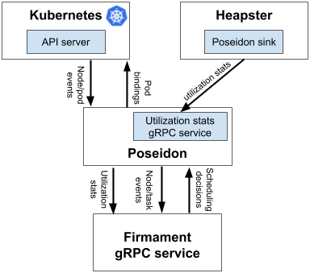
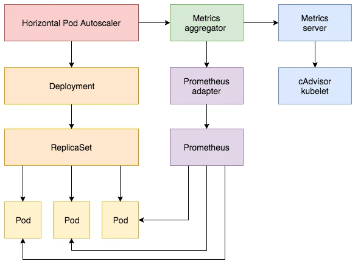

# kubernetes sigs (PQRST)

本文为开头字母 P~T 的 Kubernetes 兴趣小组项目的大致介绍，收录截至 2021 年 8 月。

**目录:**

| project | star | fork |
| ------- | ---- | ---- |
| [Poseidon](#poseidon) | 388 | 75 |
| [Prometheus-adapter](#prometheus-adapter) | 1.2k | 366 |
| [provider-aws-test-infra](#provider-aws-test-infra) | 2 | 1 |
| [reference-docs](#reference-docs) | 42 | 54 |
| [release-notes](#release-notes) | 34 | 33 |
| [release-sdk](#release-sdk) | 3 | 4 |
| [release-utils](#release-utils) | 5 | 7 |
| [scheduler-plugins](#scheduler-plugins) | 302 | 126 |
| [secrets-store-csi-driver](#secrets-store-csi-driver) | 429 | 110 |
| [security-profiles-operator](#security-profiles-operator) | 176 | 29 |
| [service-catalog](#service-catalog) | 1015 | 388 |
| [sig-storage-lib-external-provisioner](#sig-storage-lib-external-provisioner) | 309 | 112 |
| [sig-storage-local-static-provisioner](#sig-storage-local-static-provisioner) | 606 | 227 |
| [sig-usability](#sig-usability) | 7 | 4 |
| [sig-windows-dev-tools](#sig-windows-dev-tools) | 28 | 12 |
| [sig-windows-samples](#sig-windows-samples) | 2 | 4 |
| [sig-windows-tools](#sig-windows-tools) | 51 | 64 |
| [slack-infra](#slack-infra) | 73 | 28|
| [structured-merge-diff](#structured-merge-diff) | 48 | 39|

## Poseidon

github: [poseidon](https://github.com/kubernetes-sigs/poseidon)

Poseidon 是 Firmament 调度器在 k8s 中的实现。Firmament 可以将工作负载和集群建模为流网络，并在这些网络上运行最小成本流优化以做出调度决策。完整说明：

> Firmament 是一个基于流的调度器，它将工作负载（正在运行和提交的 pod）和集群（例如，节点、机架）建模为一个流网络。Firmament 根据其调度策略修改这个流网络以响应事件（例如，任务提交、任务完成、节点故障）和监控信息（例如，资源利用率）。接下来，Firmament 在流网络上运行最小成本流算法以找到最佳流，从而判断 pod 应该调度的位置。

注： Heapster 已被废弃，项目过渡到 Metrics server

[设计文档](https://github.com/kubernetes-sigs/poseidon/blob/master/docs/design/README.md)

**主要优势**：

- 支持大容量工作负载放置。
- 复杂的规则约束。
- 给定策略的全局最优调度。
- 极高的可扩展性。

## Prometheus-adapter

github: [prometheus-adapter](https://github.com/kubernetes-sigs/prometheus-adapter)

Horizo​​ntal Pod Autoscaler(HPA) 用于自动动态调整计算能力。当 HPA 使用自定义指标作为判断时，需要提供标准的 Custom Metric API，，当前大部分用户使用 Prometheus-Adapter 来提供 Custom Metric API，其主要功能是将接受到 custom metric api 转换成 Prometheus 的请求，从 Prometheus 中查询数据返回给 API Server

## provider-aws-test-infra

github: [provider-aws-test-infra](https://github.com/kubernetes-sigs/provider-aws-test-infra)

为 AWS 仓库共享的测试基础架构。目前项目为空。

## reference-docs

github: [reference-docs](https://github.com/kubernetes-sigs/reference-docs)

为 Kubernetes API 和 CLI 构建参考文档的工具

使用参考 [为 kubectl 命令集生成参考文档](https://kubernetes.io/zh/docs/contribute/generate-ref-docs/kubectl/)

## release-notes

github: [reference-notes](https://github.com/kubernetes-sigs/reference-notes)

轻量级发版说明web，可帮助用户跟踪不断变化的 Kubernetes 代码库

## release-sdk

github: [release-sdk](https://github.com/kubernetes-sigs/release-sdk)

用于构建Kubernetes版本的接口和实现。 目前只初始化了仓库，没有实际作用。

## release-utils

github: [release-utils](https://github.com/kubernetes-sigs/release-utils)

用于发布子项目和 K8s 版本的微型工具集。

## scheduler-plugins

github: [scheduler-plugins](https://github.com/kubernetes-sigs/scheduler-plugins)

用于新增一个 k8s 调度器或者替换默认的调度器。该仓库提供了一个新的调度器以及适用于该调度器的一些插件，用于自定义调度器的一些流程或者算法。

[调度器配置](https://kubernetes.io/zh/docs/reference/scheduling/config/)

## secrets-store-csi-driver

github: [secrets-store-csi-driver](https://github.com/kubernetes-sigs/secrets-store-csi-driver)

Secrets Store CSI driver 允许 Kubernete s将存储在企业级（指 aws/azure等 公有云）外部密钥存储中的多个 Secret、密钥和证书作为卷装载到 POD 中。挂载卷后，其中的数据将装入容器的文件系统。

## security-profiles-operator

github: [secrets-store-csi-driver](https://github.com/kubernetes-sigs/secrets-store-csi-driver)

该项目是 K8s 的一个安全增强 Operator，旨在使在 Kubernetes 中管理和应用 seccomp 和 AppArmor 配置文件更加简单直接。随着未来发展，本项目将以帮助 Kubernetes 用户为 seccomp、AppArmor、SeLinux、PodSecurityPolicies 和 RBAC 权限创建、分发和应用安全配置文件为主要目标。

**seccomp**: (k8s v1.19 GA, 相关可参考: https://zhuanlan.zhihu.com/p/202523932)

> seccomp（全称 securecomputing mode）是 linux kernel 从 2.6.23 版本开始所支持的一种安全机制。
> 在 Linux 系统里，大量的系统调用（systemcall）直接暴露给用户态程序。但是，并不是所有的系统调用都被需要，而且不安全的代码滥用系统调用会对系统造成安全威胁。通过 seccomp，我们限制程序使用某些系统调用，这样可以减少系统的暴露面，同时是程序进入一种 “安全” 的状态。
> -- https://www.dazhuanlan.com/yayakin/topics/1087090

**AppArmor**: (k8s v1.4 beta)

> Apparmor 是一个 Linux 内核安全模块，它补充了标准的基于 Linux 用户和组的安全模块将程序限制为有限资源集的权限。 AppArmor 可以配置为任何应用程序减少潜在的攻击面，并且提供更加深入的防御。 AppArmor 是通过配置文件进行配置的，这些配置文件被调整为允许特定程序或者容器访问，如 Linux 功能、网络访问、文件权限等。 每个配置文件都可以在*强制（enforcing）模式（阻止访问不允许的资源）或投诉（complain）*模式 （仅报告冲突）下运行。
> -- https://kubernetes.io/zh/docs/tutorials/clusters/apparmor/

## service-catalog

github: [service-catalog](https://github.com/kubernetes-sigs/service-catalog)

[概念](https://svc-cat.io/docs/concepts/)

service-catalog 项目正在孵化中，其通过 [Open Service Broker API](https://github.com/openservicebrokerapi/servicebroker) 将 `服务代理(service broker)` 集成到 Kubernetes 生态系统中。

`服务代理` 是一个端点，用于管理一组名为 Services 的软件产品。service-catalog 项目的最终目标是为 Kubernetes 用户提供一种使用来自代理的服务并轻松配置他们的应用程序以使用这些服务的方式，并且无需详细了解这些服务是如何创建或管理的。

举个例子：

大多数应用程序都需要某种数据存储。service-catalog 允许 Kubernetes 应用程序以一种简单的方式使用存在于某处的数据库之类的服务 ：

1. 想要在其应用程序中使用数据库的用户浏览目录中的可用服务列表
2. 用户要求提供该服务的新实例
    供应意味着 broker 以某种方式创建服务的新实例,比如说：在与用户程序相同或者不同的 Kubernetes 集群中的另一个命名空间中创建一组新的 Kubernetes 资源，甚至在多租户 SaaS 系统中创建一个新租户来创建服务实例。关键是消费者根本不必了解或关心细节。
3. 用户创建一个 binding 资源以绑定应用程序和服务实例
    实例的凭据以普通 Kubernetes secrets 形式提供给用户，其包含连接到服务实例并对其进行身份验证所需的信息。

## sig-storage-lib-external-provisioner

github: [sig-storage-lib-external-provisioner](https://github.com/kubernetes-sigs/sig-storage-lib-external-provisioner)

一个用于编写自定义外部存储 provider 的工具。用于 StorageClass。

[存储制备器](https://kubernetes.io/zh/docs/concepts/storage/storage-classes/#provisioner)

## sig-storage-local-static-provisioner

github: [sig-storage-local-static-provisioner](https://github.com/kubernetes-sigs/sig-storage-local-static-provisioner)

本地卷静态配置器通过为主机上的每个本地磁盘检测和创建 PV 并在释放时清理磁盘来管理预分配磁盘的 PersistentVolume 生命周期，不支持动态配置。

即通过在每个节点上监听磁盘或者目录的状态以自动创建 PV。

## sig-usability

github: [sig-usability](https://github.com/kubernetes-sigs/sig-usability)

空项目。猜测是用于管理 sig 项目的可用性的。

## sig-windows-dev-tools

github: [sig-windows-dev-tools](https://github.com/kubernetes-sigs/sig-windows-dev-tools)

这是一个全量的 Kubernetes 上的 Windows 开发环境，包括：

- 用于启动两节点集群的 Vagrant 文件
- 最新的Containerd
- 支持两个 CNI：antrea 或 calico on containerd：在 variables.yml 中配置您的 CNI 选项
  - 基于 containerd 的 calico 3.19 支持开箱即用
  - antrea 0.13.2 可运行但需要额外运行 https://github.com/antrea-io/antrea/issues/2344 的补丁，该补丁最近可用
- Antrea和Calico提供的对 Windows 和 Linux 的 NetworkPolicy 支持
- 完全从源代码构建的 kube-proxy.exe 和 kubelet.exe 的 Windows 二进制文件（基于 K8s 主分支）
- Kubeadm 安装可以将前沿 Linux 控制平面配置到位，因此您可以测试新功能，如特权容器

## sig-windows-samples

github: [sig-windows-samples](https://github.com/kubernetes-sigs/sig-windows-samples)

和 k8s 中的 sig-windows 相关的样本和示例。包含了一个培训用户使用 Visual Studio 和开发实践的相关文档。

## sig-windows-tools

github: [sig-windows-tools](https://github.com/kubernetes-sigs/sig-windows-tools)

和 k8s 中的 sig-windows 相关的工具和产成品。存储了辅助 Kubeadm 和 Wincat 和 Flannel 的脚本。

## slack-infra

github: [slack-infra](https://github.com/kubernetes-sigs/slack-infra)

此 repo 包含用于 Kubernetes slack 实例的工具。

包含以下工具：

- slack-event-log：全局 Kubernetes 事件的事件日志记录。监听用户加入、创建/删除表情符号等。
- slack-report-message：使用户可以选择匿名报告消息，并将这些报告发送到某个 Slack 频道
- slack-moderator : 和 slack-report-message 相似，但如果 Slack admin 或 owner 使用“report”按钮，则让他们删除用户和/或其内容。
- slack-moderator-words：如果用户使用非指定的语言，则向用户显示一条消息
- slack-welcomer：向每个加入 Slack 的用户发送欢迎信息。
- slack-post-message：使属于给定 slack 用户组的用户能够使用模板表单在多个频道中发布消息
- Tempelis：使用 yaml 配置文件控制您的 Slack 设置。结合 CI 系统实现 Slack GitOps。

## structured-merge-diff

github: [structured-merge-diff](https://github.com/kubernetes-sigs/structured-merge-diff)

“服务端 apply”的测试用例和实现。此 repo 包含实现 Kubernetes “apply” 操作的代码。

**关于 Apply 操作:**

k8s 中有两种基本机制可以用来修改对象。

PUT/PATCH：这是一个 write 命令，它说：“使对象看起来完全像 X(指应用了新属性的对象)”。

APPLY：这是一个 write 命令，它说：“我管理的字段现在应该看起来完全像这样（但我不关心其他字段）”。

对于 PUT/PATCH，本库会根据发生的变化推断哪些字段将被管理。对于 APPLY，用户明确说明他们希望管理哪些字段（因此要求删除他们曾经管理但不再提及的任何字段）。

每当 manager 开始管理某个新字段时，该字段将从所有其他 manager 中删除。如果 manager 正在使用 APPLY 命令，如果发生冲突，除非用户通过“force”选项，否则不会继续。这可以防止意外修改了其他 manager 正在管理的字段。

PUT/PATCH 总是“force”。它们主要由自动化系统使用，对于新的错误类型，它不会做任何的事情。
