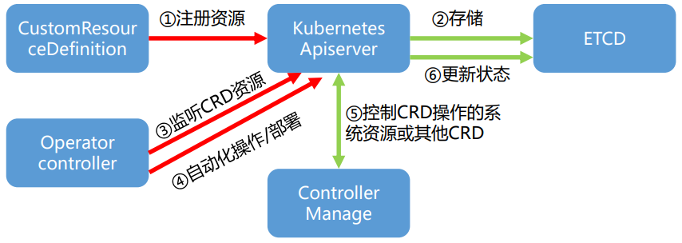
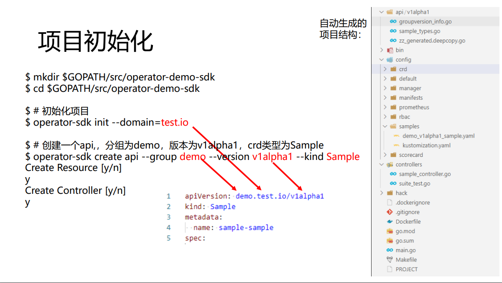
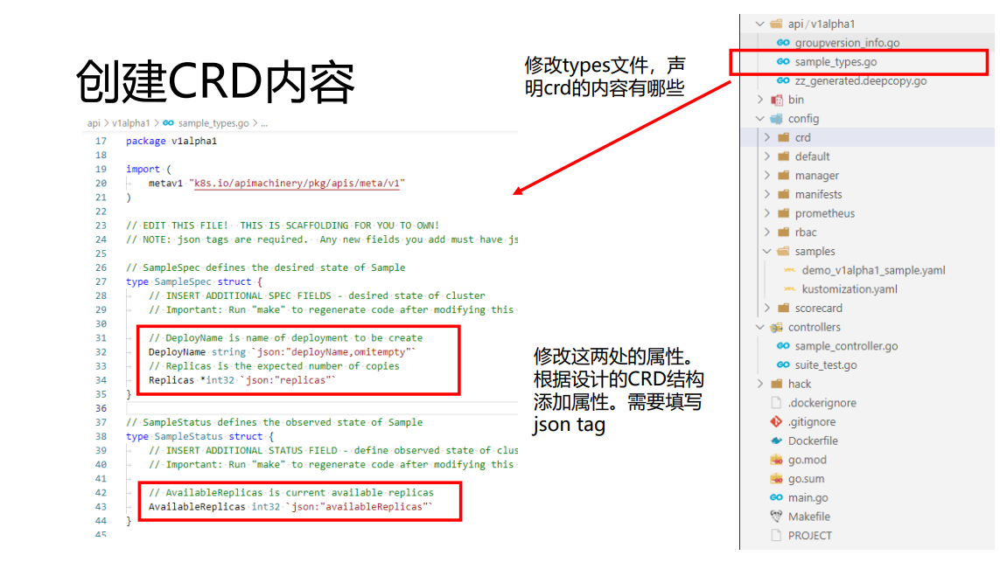
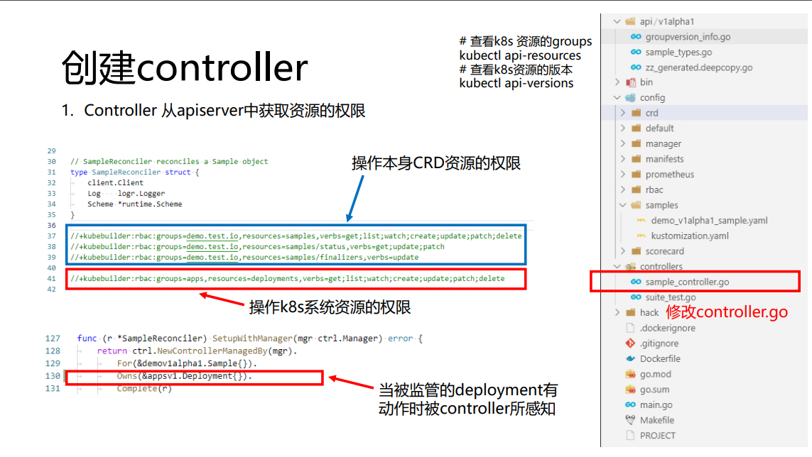
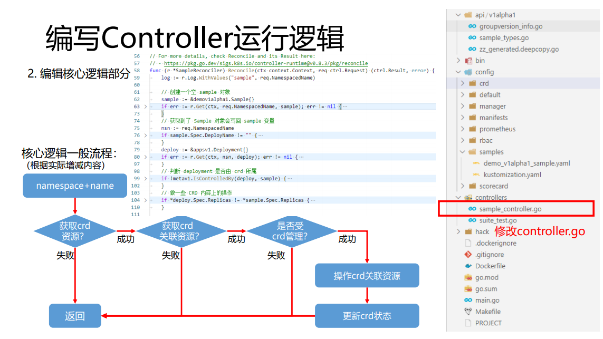
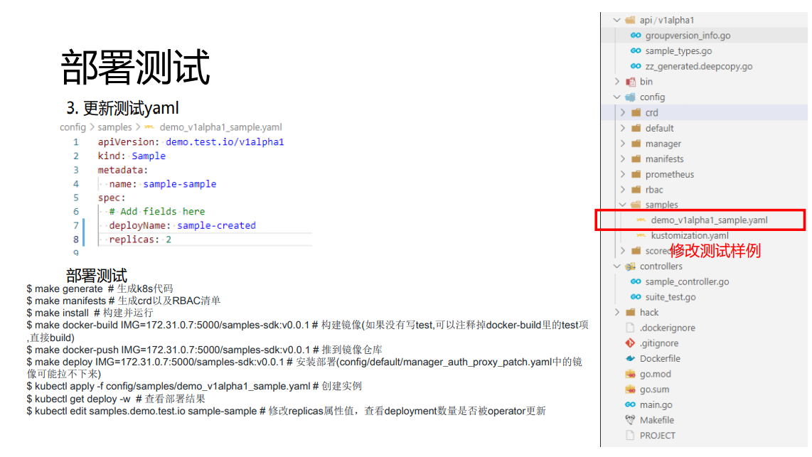
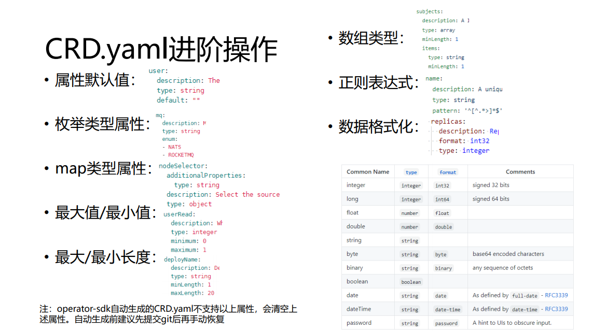
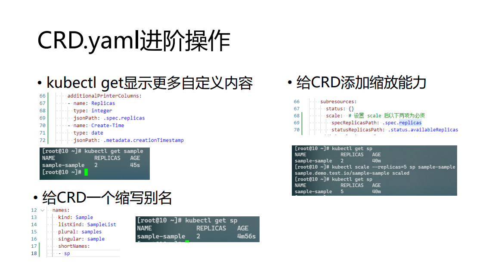
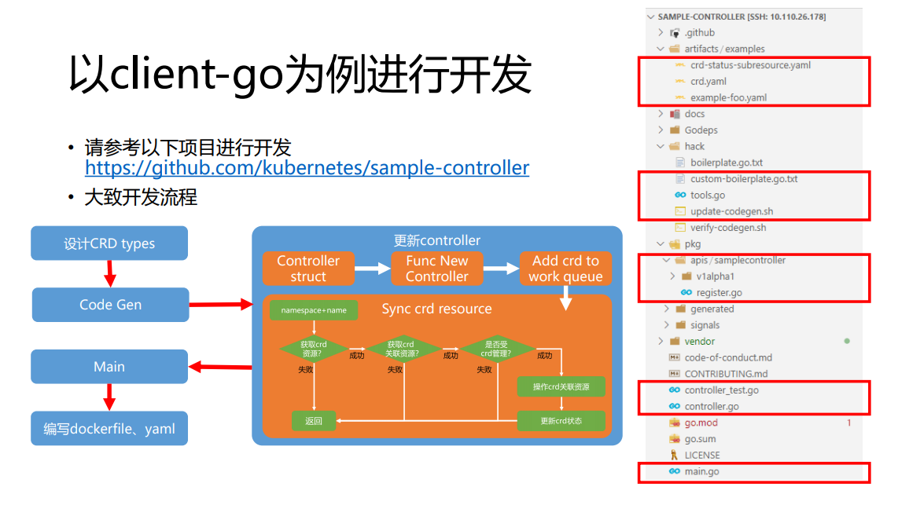

# 从 0 上手 Operator

## 概念

### 概述

Operator 是 Kubernetes 的扩展软件，它利用 [定制资源](https://kubernetes.io/zh/docs/concepts/extend-kubernetes/api-extension/custom-resources/) 管理应用及其组件。

### 目标

利用K8s的自动化能力，来帮助应用、服务的自动化部署，减少重复的劳动

### 基本工作原理



需要处理的地方：

1. CRD 资源的定义
2. Controller 对 Apiserver 的访问权限
3. Controller 的实现

## 构建工具

* [Kubebuilder](https://github.com/kubernetes-sigs/kubebuilder) (来自 kubernetes) 和 [Operator SDK](https://github.com/operator-framework/operator-sdk) (来自 CoreOS) 是开发 operator 的两种常用 SDK, 两者旨在简化构建 Kubernetes Operator（或controller）的过程。这两个项目都大量使用了上游的控制器运行时和控制器工具项目，因此支持类似的 Go 源文件和包结构。**目前两个项目在逐渐整合中。**

* 直接使用 client-go 以及上游的控制器工具进行构建。

## 以 Operator SDK 为例进行开发

**安装工具:**

> ref: https://sdk.operatorframework.io/docs/installation/

```BASH
$ export ARCH=$(case $(uname -m) in x86_64) echo -n amd64 ;; aarch64) echo -n arm64 ;; *) echo -n $(uname -m) ;; esac) 
$ export OS=$(uname | awk '{print tolower($0)}') 
$ export OPERATOR_SDK_DL_URL=https://github.com/operator-framework/operator-sdk/releases/download/v1.7.2 
$ curl -LO ${OPERATOR_SDK_DL_URL}/operator-sdk_${OS}_${ARCH} 
$ chmod +x operator-sdk_${OS}_${ARCH} && sudo mv operator-sdk_${OS}_${ARCH} /usr/local/bin/operator-sdk 

$ operator-sdk version
operator-sdk version: "v1.7.2", commit: "6db9787d4e9ff63f344e23bfa387133112bda56b", kubernetes version: "1.19.4", go version: "go1.15.5", GOOS: "linux", GOARCH: "amd64"
```

**样例地址:** https://github.com/JackZxj/operator-demo-sdk

样例内容: 每个 CustomResource 管理名称为 deployName 的 nginx Deployment 的副本个数

### 项目初始化

```BASH
$ mkdir $GOPATH/src/operator-demo-sdk
$ cd $GOPATH/src/operator-demo-sdk

# 初始化项目
$ operator-sdk init --domain=test.io

# 创建一个api,，分组为demo，版本为v1alpha1，crd类型为Sample
$ operator-sdk create api --group demo --version v1alpha1 --kind Sample
Create Resource [y/n]
y
Create Controller [y/n]
y
```



### 编写







### 部署

```BASH
$ make generate  # 生成k8s代码 
$ make manifests # 生成crd以及RBAC清单 
$ make install   # 部署 crd 到 k8s 集群
$ make docker-build IMG=172.31.0.7:5000/samples-sdk:v0.0.1 # 构建镜像(如果没有写test,可以注释掉docker-build里的test项,直接build)
$ make docker-push IMG=172.31.0.7:5000/samples-sdk:v0.0.1 # 推到镜像仓库
$ make deploy IMG=172.31.0.7:5000/samples-sdk:v0.0.1 # 安装部署(config/default/manager_auth_proxy_patch.yaml中的镜像可能拉不下来)
$ kubectl apply -f config/samples/demo_v1alpha1_sample.yaml # 创建实例
$ kubectl get deploy -w  # 查看部署结果
$ kubectl edit samples.demo.test.io sample-sample # 修改replicas属性值，查看deployment数量是否被operator更新
```



### CRD.yaml 进阶操作





### 更多操作

1. 限制 controller管理的namespace

    参照 [动态配置监视名称空间](https://sdk.operatorframework.io/docs/building-operators/golang/operator-scope/#configuring-watch-namespaces-dynamically)

2. 在完成删除CRD资源前进行一些预处理操作

    参照 [删除前预处理](https://sdk.operatorframework.io/docs/building-operators/golang/advanced-topics/#handle-cleanup-on-deletion)

3. 多副本

    参照 [Leader选举](https://sdk.operatorframework.io/docs/building-operators/golang/advanced-topics/#leader-election)

## 以 client-go 为例进行开发


