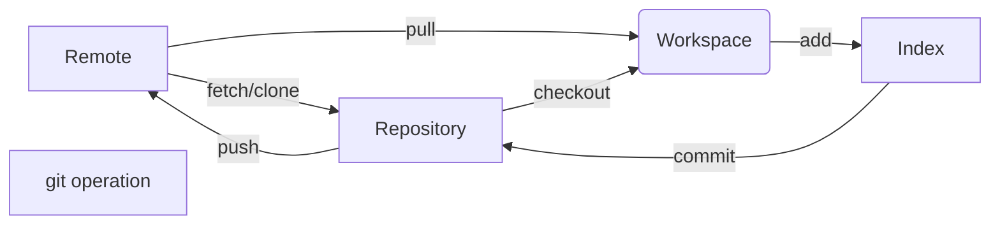

## normal operation

```bash
git init    # 初始化代码仓库，用于在新文件夹内执行
git remote add <orginName> <http://xxxxxxxx.git>    # 添加源并为该源取名为orginName
git remote rm <orginName>    # 删除某个源
git remote -v    # 查看所有远程仓库
git clone <path>    # 从代码仓库复制一份拷贝到本地，path可以是html/filepath/ftp……
git branch <branchName>    # 创建一个名为branchName的分支
git branch -d [-r] <branchName>    # 删除[远程]分支
git branch -a    # 显示所有分支

git checkout [-b] <branchName>    # (-b表示如果不存在则创建)切换到branchName分支
git checkout -b <localBranch> <origin/originBranch>    # 切换到远程分支

# git checkout -b <dev_new> <otherOrigin/otherOriginBranch>
# 报错：不能同时更新路径并切换到分支'dev_new'
# 可能是没有把远程更新到本地，需要运行 git fetch otherOrigin 然后再重新运行

git fetch <orginName>    # 这个命令将某个远程主机的更新全部取回本地
git fetch origin <branchName>    # 从远程主机的branchName分支拉取最新内容 
git log -p FETCH_HEAD    # 查看拉下来的分支与当前分支的区别
git merge FETCH_HEAD    # 将拉取下来的最新内容合并到当前所在的分支中
# pull = fetch + merge
git pull <orginName> <originBranch>:<localBranch>    # 将远程分支与本地分支合并

git log    # 查看 commit 日志
git reset --hard <commit_id>    # 如果只是本地 commit 还没有提交到远程仓库，可以使用 reset 来取消一些错误的 commit, 若回退到的版本老于远程库，则需要使用 git push -f 强制推送
git revert -n <commit_id>    # 相当于提交一个新的 commit， commit的内容是反做 commit_id 提交的改动
# 可以看看这个关于高级合并的说明： https://git-scm.com/book/zh/v2/Git-%E5%B7%A5%E5%85%B7-%E9%AB%98%E7%BA%A7%E5%90%88%E5%B9%B6

git push <orginName> <localBranch>:<originBranch>    # 将本地分支推送到源，若 localBranch 为空，则删除远程 originBranch

# 远程分支已删除，本地还能看到被删除的远程分支
git remote show <orginName>     # 查看本地分支和远程分支的关系，如果有已被删除的远程分支会显示 stale
git remote prune <orginName>    # 清除本地缓存中已删除的远程分支

# 取消本地 commit
git reset --soft HEAD^ # 取消上一次 commit 使其返回到暂存 (staged) 状态
git reset --mixed HEAD~2 # 取消前两次 commit 且取消暂存，reset 的默认操作，等价于 git reset HEAD~2 
git reset --hard <commit_id> # 回退到某一次 commit 并且清除所有改动
git reset --hard <origin/originBranch> # 回退到和远程一样并且清除所有改动

# rebase 压缩提交
git rebase -i HEAD~3  # 基于提交次数进行rebase，表示对HEAD之前的3次提交进行rebase操作
git rebase -i <commit_id>  # 基于 commit id 进行rebase，可操作的commit不包括此id
git rebase -i origin/master # 基于branch或者标签进行rebase
# 运行上述命令后会使用编辑器提示需要合并或者压缩的列表，使用 p(pick) 表示保留commit，使用 s(squash) 表示压缩该条记录，完成后提交新的 commit 记录

# 查看本地所有分支的最后 commit 时间
git for-each-ref --sort='-committerdate:iso8601' --format=' %(committerdate:iso8601)%09%(refname)' refs/heads
# 如果需要看某个远程分支，运行 git fetch <orginName> 后
git for-each-ref --sort='-committerdate:iso8601' --format=' %(committerdate:iso8601)%09%(refname)' refs/remotes/<orginName>

# 浅克隆
git clone <path> --depth=N
# 从浅克隆恢复到完整仓库
git fetch --unshallow


# 强制更新本地的 tag，解决tag冲突，如 would clobber existing tag
git fetch --tags -f
```



## git commit

* feat：新功能（feature）
* fix：修补bug
* docs：文档（documentation）
* style： 格式（不影响代码运行的变动）
* refactor：重构（即不是新增功能，也不是修改bug的代码变动）
* test：增加测试
* chore：构建过程或辅助工具的变动

### changelog from commit

Makefile:

``` Makefile
.PHONY: changelog changelog-docker
EXECUTABLES = node npm conventional-changelog
changelog:
	$(foreach exec,$(EXECUTABLES),\
		$(if $(shell which $(exec)), ,$(error "$(exec) not in PATH, requires: nodejs >= 16.0, npm>=8.0, then: npm install -g conventional-changelog-cli")))
	npm run changelog

changelog-docker:
	docker run -it -v .:/project -e GOPATH=NO_USE --rm --entrypoint bash node:bullseye -c "npm install -g conventional-changelog-cli ; cd /project ; make changelog"
```

package.json:

```json
{
  "name": "Your app name",
  "version": "Your app version",
  "description": "Some texts.....",
  "repository": {
    "type": "git",
    "url": "https://github.com/xxx/yyy.git"
  },
  "scripts": {
    "changelog": "conventional-changelog -p angular -n './changelog-config.js' -i CHANGELOG.md -s"
  }
}
```

[changelog-config.js](./changelog-config.js)

example result:

``` markdown
# [1.1.0](https://github.com/xxx/yyy/compare/1.0.0...1.1.0) (2023-09-06)


### 🌟 Features | 新增功能

* add some logs ([fb18b7e](https://github.com/xxx/yyy/commits/fb18b7e03c41775dff871e931bfa39808afd3d91))  , by [xiaoming](mailto:xiaoming@mail.com)


### 🐛 Bug Fixes | 修复 bug

* fix some bugs ([1e9ad54](https://github.com/xxx/yyy/commits/1e9ad54db1861d01bd354210b459cf88dbaef47a))  , by [xiaozhang](mailto:xiaozhang@mail.com)


```