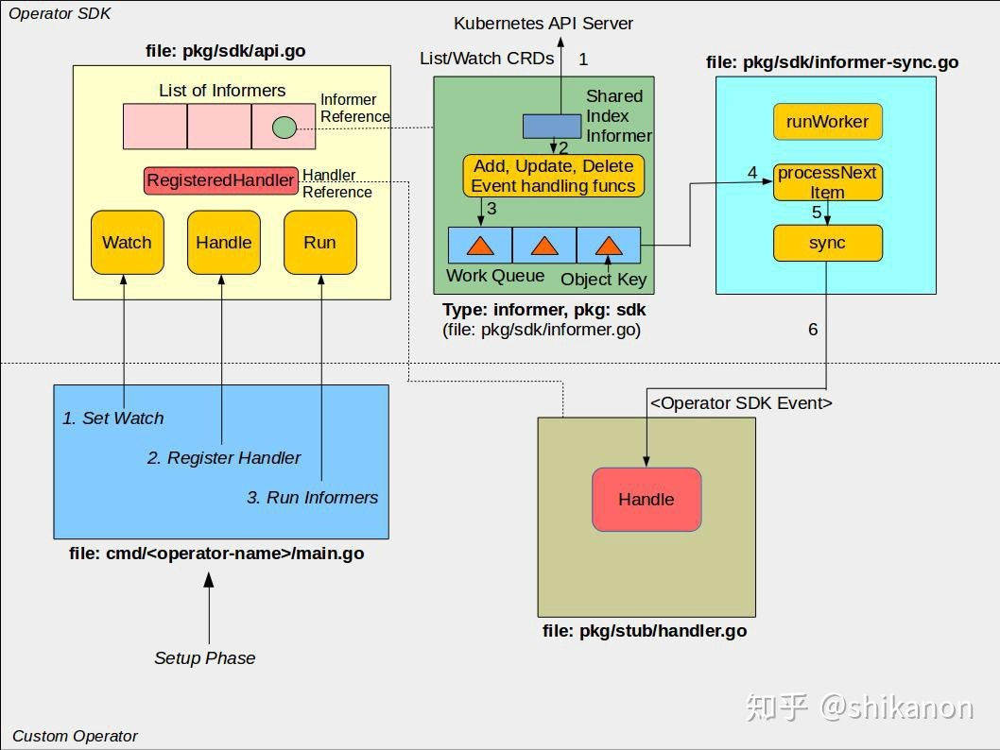
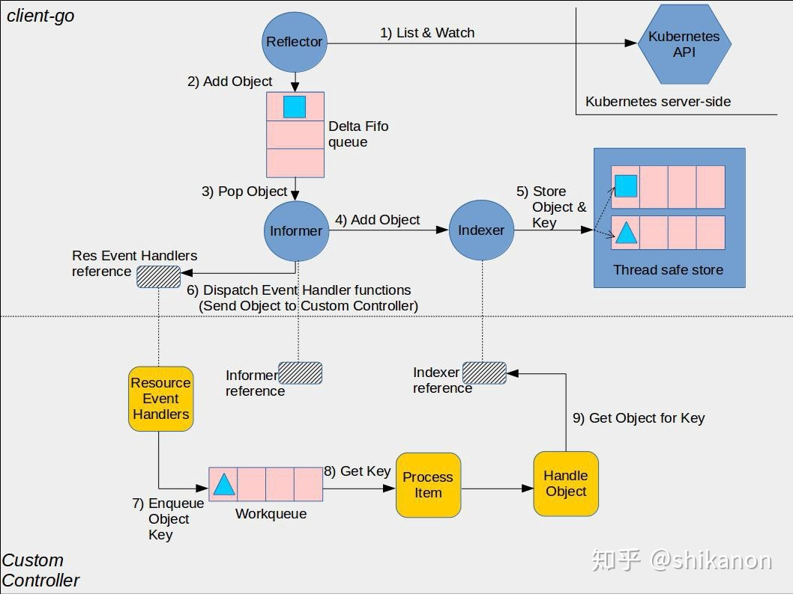
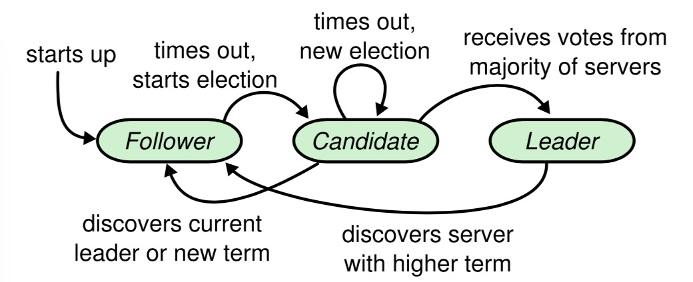

1. Golang的struct结构体是否可以直接比较

    * 同一个struct如果成员都是简单数据类型（可比较的）就能直接比较，如果有不可比较的成员就不能直接比较。
    * 不同struct如果能相互转化，那么转化后的实例比较规则同上。不能转化的无法比较。

2. 命名返回问题： 命名返回会被 return 覆盖

```Go
package main
import "fmt"
func named() (n, _ int) {
    return 1, 2
}
func main() {
    fmt.Print(named()) // 1 2
}
```

以上代码输出什么？ [A: 1 0] [B: 1 2] [C: 0 0] [D: 编译错误]

3. defer 延迟返回

```Go
package main
import "fmt"
func hello1(i *int) int {
    defer func() {*i = 19}()
    return *i
}
func hello2(i *int) (j int) {
    defer func() {j = 19}()
    j = *i
    return j
}
func hello3(i *int) (j int) {
    defer func() {j = 19}()
    return *i
}
func main() {
    i1 := 10
    j1 := hello1(&i1)
    fmt.Println(i1, j1) // 19 10

    i2 := 10
    j2 := hello2(&i2)
    fmt.Println(i2, j2) // 10 19

    i3 := 10
    j3 := hello3(&i3)
    fmt.Println(i3, j3) // 10 19
}
```

```Go
func foo() int {
    var n int = 3

    defer func() {
        fmt.Printf("foo defer-1: %d\n", n) // foo defer-1: 5
    }()

    defer func(n int) {
        fmt.Printf("foo defer-2: %d\n", n) //foo defer-2: 3
    }(n)

    defer func() {
        fmt.Printf("foo defer-3: %d\n", n) // foo defer-3: 6
        n--
    }()

    for i := 0; i < 3; i++ {
        n++
    }

    fmt.Printf("foo: %d\n", n) // foo: 6

    return n // return 6
}

func main() {
    fmt.Printf("main: %d\n", foo()) // main 6
} 
// foo: 6
// foo defer-3: 6
// foo defer-2: 3
// foo defer-1: 5
// main 6
```

2. map 遍历是无序的，不能保证每次遍历结果相同，可以把 key 存到一个 slice 中，遍历 slice 实现有序访问


2. 简述如何安全更新一个并发的Map

    ``` Go
    lock.RLock()
    if _, present := sources[name]; !present {
        lock.RUnlock()
        lock.Lock()
        if _, present = sources[name]; !present {
            sources[name] = newObj
        }
        lock.Unlock()
    } else {
        lock.RUnlock()
    }
    ```

3. sync.Map实现原理，适用的场景

    > https://blog.csdn.net/u011957758/article/details/96633984

    sync.Map 适合读多的情况, 写多用 map + RWmutex

5. 如何安全退出一个正在运行中的 Goroutine

    1). 使用 channel 和 select 机制，在子线程中监听一个中断信号量
    2). 使用 context

3. Golang PGM调度模型

    > https://github.com/lifei6671/interview-go/blob/master/base/go-gpm.md

    GPM代表了三个角色，分别是Goroutine、Processor、Machine。

    * Goroutine：就是咱们常用的用go关键字创建的执行体，它对应一个结构体g，结构体里保存了goroutine的堆栈信息
    * Machine：表示操作系统的线程,
    * Processor：表示 --处理器-- 上下文，有了它才能建立G、M的联系

    n 个 Processor 的机器默认启动 n 个 Machine 并相互绑定, 创建 Goroutine 时如果有空闲 Processor 则优先调度，否则进入全局队列等待。Machine 负责调度 Goroutine 在 Processor 上运行，优先获取 Processor 的私有队列中的 Goroutine，然后再从全局队列中取；如果没有额外的 Goroutine, 则 Machine 断开绑定的 Processor 进入休眠。

4. Golang GC 原理

    > https://www.cnblogs.com/maoqide/p/12355565.html

    三色标记清除法：
    (1). 初始化所有对象为白色
    (2). gc 扫描，将可以访问的对象设置为灰色
    (3). 遍历灰色对象，寻找其引用的对象，将被引用的对象设置为灰色，将自身设置为黑色
    (4). 清除剩下的白色对象

    传统的标记-清除算法，为了防止在标记过程中，对象引用发生变化，导致清除仍在使用的对象，需要 STW(Stop The World)，这会造成程序的停顿。三色机制中删除操作和用户逻辑可以并发。

    **写屏障**机制: 在标记的过程中，通过写屏障记录发生变化的指针，然后在 Mark termination 的 rescan 过程中，重新进行扫描，因为在这一步骤会短暂 STW

11. 简述 K8s 的组件极其作用

    > https://kubernetes.io/zh/docs/concepts/overview/components/

    * kube-apiserver
    * etcd
    * kube-scheduler
    * kube-controller-manager
    * cloud-controller-manager
    * kubelet
    * kube-proxy
    * Container Runtime

7. k8s 支持的自动拓展方式

    HPA:
    1). 部署 metrics-server 抓取监听 pod 使用率
    2). 部署 HorizontalPodAutoscaler 配置拓展触发条件
    VPA (还是早期版本):
    1). 部署 VPA, 自动更新 Deployment/StatefulSet 等对象的资源请求

8. CRD 使用使用什么工具创建，简述一下 CRD 的工作流程

    
    

10. Prometheus 组件及架构

    

9. Prometheus 的优势及不足

    > https://www.jianshu.com/p/55bf40292fff

    > 通过PromQL实现多维度数据模型的灵活查询。
    > 定义了开放指标数据的标准，自定义探针（如Exporter等），编写简单方便。
    > PushGateway组件让这款监控系统可以接收监控数据。

    **监控系统使用MQ通信的问题**
    > 很多企业自己研发的监控系统中往往会使用消息队列Kafka和Metrics parser、Metrics process server等Metrics解析处理模块，再辅以Spark等流式处理方式。应用程序将Metric推到消息队列（如Kafka），然后经过Exposer中转，再被Prometheus拉取。之所以会产生这种方案，是因为考虑到有历史包袱、复用现有组件、通过MQ（消息队列）来提高扩展性等因素。这个方案会有如下几个问题。
    > 
    > - 增加了查询组件，比如基础的sum、count、average函数都需要额外进行计算。这一方面多了一层依赖，在查询模块连接失败的情况下会多提供一层故障风险；另一方面，很多基本的查询功能的实现都需要消耗资源。而在Prometheus的架构里，上述这些功能都是得到支持的。
    > - 抓取时间可能会不同步，延迟的数据将会被标记为陈旧数据。如果通过添加时间戳来标识数据，就会失去对陈旧数据的处理逻辑。
    > - Prometheus适用于监控大量小目标的场景，而不是监控一个大目标，如果将所有数据都放在Exposer中，那么Prometheus的单个Job拉取就会成为CPU的瓶颈。这个架构设计和Pushgateway类似，因此如果不是特别必要的场景，官方都不建议使用。
    > - 缺少服务发现和拉取控制机制，Prometheus只能识别Exposer模块，不知道具体是哪些target，也不知道每个target的UP时间，所以无法使用Scrape_*等指标做查询，也无法用scrape_limit做限制。
    >
    > 对于上述这些重度依赖，可以考虑将其优化掉，而Prometheus这种采用以拉模式为主的架构，在这方面的实现是一个很好的参考方向。同理，很多企业的监控系统对于cmdb具有强依赖，通过Prometheus这种架构也可以消除标签对cmdb的依赖。

    **不足**
    > 1. 更多地展示的是趋势性的监控
    > Prometheus作为一个基于度量的系统，不适合存储事件或者日志等，它更多地展示的是趋势性的监控。如果用户需要数据的精准性，可以考虑ELK或其他日志架构。另外，APM更适用于链路追踪的场景。
    > 
    > 2. Prometheus本地存储不适合大量历史数据存储
    > Prometheus认为只有最近的监控数据才有查询的需要，所有Prometheus本地存储的设计初衷只是保存短期（如一个月）的数据，不会针对大量的历史数据进行存储。如果需要历史数据，则建议使用Prometheus的远端存储，如OpenTSDB、M3DB等。

8. 简述 raft 几个状态转移流程

    

6. 简述 HTTP和QUIC协议的区别

    > https://www.cnblogs.com/amyzhu/p/8285300.html

9. P2P 打洞流程

10. 服务发现的原理

10. 离线推送服务实现