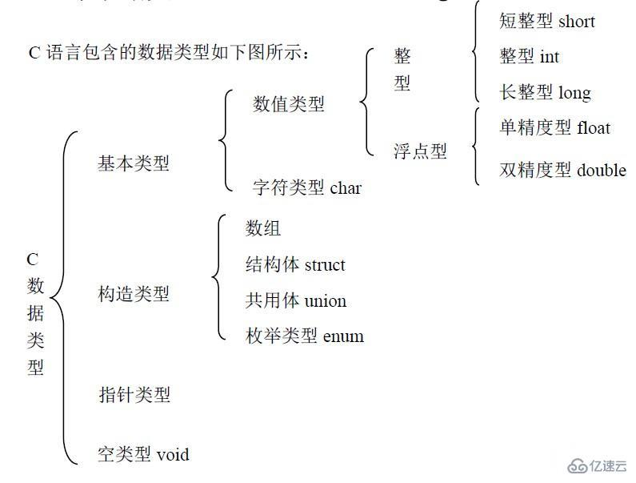
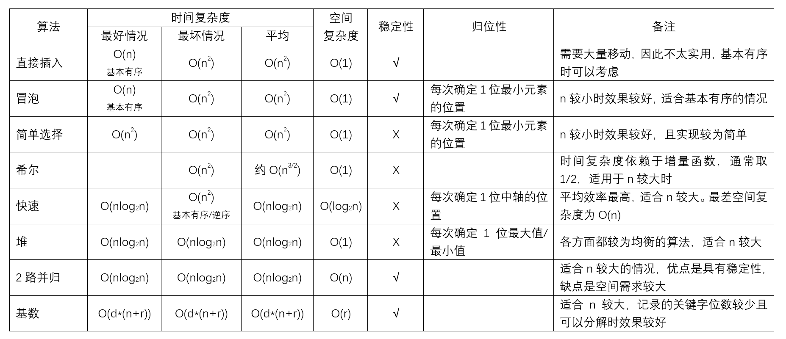

# newer interview

02. c语言数据类型有哪些
    short、int、long、char、float、double 这六个关键字代表C 语言里的六种基本数据类型
    

03. c语言的传参有值传递和地址传递，有什么区别？

04. 简单介绍几大排序，时间复杂度，空间复杂度
    | name | 空间复杂度 | 时间复杂度 | 稳定性 | 算法简介 |
    | ---  | ---        | ---        | ---    | ---      |
    | 插入排序 | O(1) | O(n^2) | 稳定 | 每次从未排序数列中取出一个数插入到已有序的数列中 |
    | 希尔排序 | O(1) | 约O(n^1.5), 最坏不超过O(n^2) | 不稳定 | 分组排序，使得小组内有序，不断缩小小组的规模，使得数组整体越来越有序，直到小组间隔为1完成排序 |
    | 冒泡选择 | O(1) | O(n^2) | 稳定 | 取两个数进行比较，将小的数交换到前面，再不断地拿小的数与前面的数进行比较，反复交换。 |
    | 快速排序 | O(1) (堆栈空间: 最坏O(n) 最好O(log2(n))) | 最坏O(n^2) 最好O(n*log2(n))  | 不稳定 | 将一个序列分成两个子序列，调整两个序列中的元素使得前一个序列的元素都小于分界元素，后一个序列的元素都大于分界元素。反复迭代最终使得整个序列有序 |
    | 简单选择 | O(1) | O(n^2) | 不稳定 | 每一次从剩余序列中选择出最小的序列放到前面 |
    | 堆排序 | O(1) | O(n * log2 (n) ) | 不稳定 | 建立一个树形结构，使得元素满足父母结点值大于子女结点值（大根堆）。当要排序时，每次把根结点取出，再从堆底哪一个元素代替根节点，重新调整堆结构，依次执行直到堆空。取出的结点便是排序结果。 |
    | 并归排序 | O(n) | O(n * log2 (n) ) (一趟并归需要O(n)，一共执行O( log2(n) )趟) | 稳定 | 将两个有序表并归到一个大的有序表(二路并归有序表内数量 1 -> 2 -> 4 -> 8 ...) |
    | 基数排序 | O(r)r为基数，也就是桶的个数 | O(d * (n + r) ) d为趟数，在数字排序中即为位数，n为数字的个数 | 稳定 | 不是基于比较的排序，考虑的是关键字序列的优先级进行排序，如：将数字拆解为不同的位，对不同的位的优先级进行比较 |

    

05. 有一些带有+-*/()的表达式字符串，怎么求这些表达式的结果，简述过程
    堆栈

05. 给你一堆不重复的数据，需要你设计一种存储方式可以满足①满足能够快速读取某一段有序序列②可以随时增删不重复的数据。怎么读，怎么增，怎么删
    二叉排序树
    平衡二叉树

06. 有一个由26个字母组成的长字符串，里头的字母有的出现的次数多，有的出现的次数少，现在需要将其压缩成二进制进行传输，应该怎么处理
    哈夫曼编码

08. 操作系统中线程与进程是什么？有什么关系
    进程: 系统进行资源分配和调度的一个独立单位
    线程: 轻量级进程，是CPU的执行单元，程序执行的最小单位，所有线程共享进程的的资源

07. 在并发中，有多个线程都需要对同一个资源进行操作时应该怎么做？不同情况下，互斥锁、读写锁、乐观锁
    互斥锁：独占资源
    读写锁：读写分离
    乐观锁：先改资源，再提交，冲突了再报错 (k8s、文档编辑)

09. 进程间通信的方式
    共享存储，需要同步互斥工具(PV操作)
    消息传递，典型方式是消息队列
    管道通信，单向通信，一端读一端写

10. 介绍一下几种磁盘调度算法
    
    | name | 思想 | 优点 | 缺点 | 
    | --- | --- | --- | --- |
    | 先来先服务(FCFS)算法 | 按访问请求到达的先后次序服务 | 公平、简单 | 平均寻道距离大，仅应用在磁盘I/O较少的场合 |
    | 最短寻找时间优先(SSTF)算法 | 优先选择距当前磁头最近的访问请求进行服务，主要考虑寻道优先 | 性能比“先来先服务”好 | 不能保证平均寻道时间最短，可能出现“饥饿”现象 |
    | 扫描算法(SCAN)算法,又称电梯算法 | 当设备无访问请求时，磁头不动；当有访问请求时，磁头按一个方向移动，在移动过程中对遇到的访问请求进行服务，然后判断该方向上是否还有访问请求，如果有则继续扫描；否则改变移动方向，并为经过的访问请求服务，如此反复 | 寻道性能较好，可避免“饥饿”现象 | 不利于远离磁头一端的访问请求 |
    | 循环扫描算法(C-SCAN)算法| 在扫描算法的基础上规定磁头单向移动来提供服务，回返时直接快速移动至起始端而不服务任何请求 | 消除了对两端磁道请求的不公平 | -- |
    \* 在实际使用时还可以改进，即磁头移动只需要到达最远端的一个请求即可返回，不需要到达磁盘端点。这种形式的SCAN算法和C-SCAN算法称为LOOK和C-LOOK调度,默认SCAN算法和C-SCAN算法为LOOK和C-LOOK调度

08. linux系统中使用过哪些常用命令，分别是做什么用的。你觉得linux和windows有什么不同

11. shell写过什么脚本？目的是什么

14. shell脚本开头的 #! 是什么意思， set -e 是什么意思

02. 项目经历，遇到了什么困难，怎么解决的

17. 购物车客户端：有没有后端？多用户同时购买怎么处理？统一用户的多个客户端怎么同步？怎么实时更新库存？

18. 写过前后端吗？用什么工具写的？如何处理用户登录信息？如何实现单用户登录？

18. 写过网络爬虫吗？怎么处理获取某个网页的所有子链接？

19. 数据库设计的基本步骤分为哪几步
    1.需求分析阶段：需求收集和分析，得到数据字典和数据流图。
    2.概念结构设计阶段：对用户需求综合、归纳与抽象，形成概念模型，用E-R图表示。
    3.逻辑结构设计阶段：将概念结构转换为某个DBMS所支持的数据模型。
    4.数据库物理设计阶段：为逻辑数据模型选取一个最适合应用环境的物理结构。
    5.数据库实施阶段：建立数据库，编制与调试应用程序，组织数据入库，程序试运行。
    6.数据库运行和维护阶段：对数据库系统进行评价、调整与修改。

20. 关系型数据库和非关系型数据库
    关系型数据库：指采用了关系模型来组织数据的数据库。
    非关系型数据库：指非关系型的，分布式系统的，且一般不确保遵照ACID标准的数据储存系统。

21. 关系型数据库的三大范式
    无重复的列：第一范式（1NF）是指数据库表的每一列都是不可分割的基本数据项，同一列中不能有多个值，即实体中的某个属性不能有多个值或者不能有重复的属性
    属性完全依赖于主键：第二范式（2NF）是在第一范式（1NF）的基础上建立起来的，即满足第二范式（2NF）必须先满足第一范式（1NF）。第二范式（2NF）要求数据库表中的每个实例或行必须可以被惟一地区分。为实现区分通常需要为表加上一个列，以存储各个实例的惟一标识。
    消除非主属性对键的传递依赖：满足第三范式（3NF）必须先满足第二范式（2NF）。简而言之，第三范式（3NF）要求一个数据库表中不包含已在其它表中已包含的非主关键字信息。

19. 学过计算机网络吗？计算机网络分为哪几层？
    应用层（Application layer,A)、传输层（Transport layer,T)网络层（Network layer,N)、数据连接层（Data link layer,D)和物理层（Physical layer,Ph)

16. 使用过 git 吗？使用流程？

24. 知道docker、kubernetes吗？对于云计算、多集群的理解？

26. 毕业设计项目？
