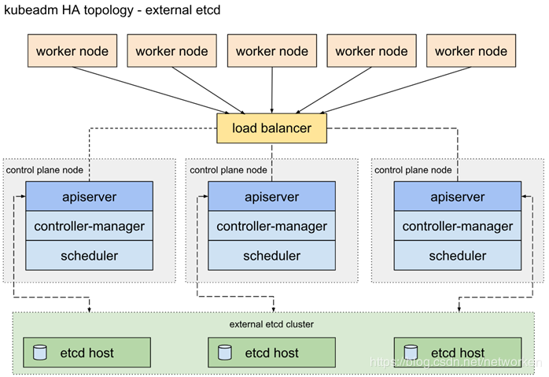
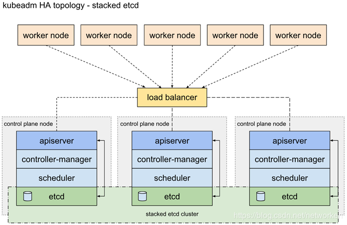
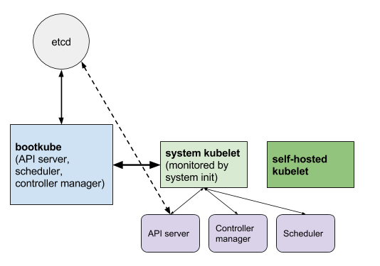

# 搭建高可用的 k8s 集群

## 需要高可用的组件

- etcd
- kube-apiserver
- kube-scheduler, kube-controller-manager, kube-proxy, kubedns...

高可用方案：

### etcd


一是使用独立的 etcd 集群，使用 3 台或者 5 台服务器只运行 etcd，独立维护和升级。甚至可以使用 CoreOS 的 update-engine 和 locksmith，让服务器完全自主的完成升级。这个 etcd 集群将作为基石用于构建整个集群。 采用这项策略的主要动机是 etcd 集群的节点增减都需要显式的通知集群，保证 etcd 集群节点稳定可以更方便的用程序完成集群滚动升级，减轻维护负担。


二是在 Kubernetes Master 上用 static pod 的形式来运行 etcd，并将多台 Kubernetes Master 上的 etcd 组成集群。 在这一模式下，各个服务器的 etcd 实例被注册进了 Kubernetes 当中，虽然无法直接使用 kubectl 来管理这部分实例，但是监控以及日志搜集组件均可正常工作。在这一模式运行下的 etcd 可管理性更强。


三是使用 CoreOS 提出的 self-hosted etcd 方案，将本应在底层为 Kubernetes 提供服务的 etcd 运行在 Kubernetes 之上。 实现 Kubernetes 对自身依赖组件的管理。在这一模式下的 etcd 集群可以直接使用 etcd-operator 来自动化运维，最符合 Kubernetes 的使用习惯。

### apiserver

一是使用外部负载均衡器，不管是使用公有云提供的负载均衡器服务或是在私有云中使用 LVS 或者 HaProxy 自建负载均衡器都可以归到这一类。 负载均衡器是非常成熟的方案，在这里略过不做过多介绍。如何保证负载均衡器的高可用，则是选择这一方案需要考虑的新问题。

二是在网络层做负载均衡。比如在 Master 节点上用 BGP 做 ECMP，或者在 Node 节点上用 iptables 做 NAT 都可以实现。采用这一方案不需要额外的外部服务，但是对网络配置有一定的要求。

三是在 Node 节点上使用反向代理对多个 Master 做负载均衡。这一方案同样不需要依赖外部的组件，但是当 Master 节点有增减时，如何动态配置 Node 节点上的负载均衡器成为了另外一个需要解决的问题。

### others

可以依赖 kubernetes 本身的 pod 多副本实现。

## HA(High Availability) k8s

选择 kubeadm 一键安装 etcd，采用 Haproxy 做负载均衡。

env：
- Vmware Virtual Machine * 4
  - CPU Core: 1
  - RAM: 2Gi
  - Disk: 40Gi
- Clusters
  - master * 3 (as node)
  - node * 1
- Support
  - k8s: v1.15.3
  - docker: v19.03.4

kubeadm-config.yaml

``` yaml
apiServer:
  extraArgs:
    authorization-mode: Node,RBAC
  timeoutForControlPlane: 4m0s
apiVersion: kubeadm.k8s.io/v1beta2
certificatesDir: /etc/kubernetes/pki
clusterName: kubernetes
controllerManager: {}
dns:
  type: CoreDNS
etcd:
  local:
    dataDir: /var/lib/etcd
imageRepository: registry.aliyuncs.com/google_containers
kind: ClusterConfiguration
kubernetesVersion: v1.15.3
controlPlaneEndpoint: "apiserver.cluster.local:6443"
networking:
  dnsDomain: cluster.local
  podSubnet: 10.253.0.0/16
  serviceSubnet: 10.96.0.0/12
scheduler: {}


apiVersion: kubeadm.k8s.io/v1beta1
kind: ClusterConfiguration
kubernetesVersion: {{.Version}}
controlPlaneEndpoint: "apiserver.cluster.local:6443"
networking:
  podSubnet: 100.64.0.0/10
apiServer:
        certSANs:
        - sealyun.com # this is what I added
        - 127.0.0.1
        - apiserver.cluster.local
        {{range .Masters -}}
        - {{.}}
        {{end -}}
        - {{.VIP}}
---
apiVersion: kubeproxy.config.k8s.io/v1alpha1
kind: KubeProxyConfiguration
mode: "ipvs"
ipvs:
        excludeCIDRs: 
        - "{{.VIP}}/32"
```